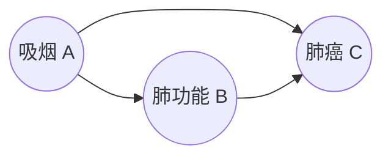

# 00 因果推断基础：DAG、d-分离、等价类与三大范式

> 一句话定位：这是整个知识库的「地基篇」。学完你能看懂任何因果发现方法的论文开头——知道它们在做一件什么事（从观测数据反推因果图）、输出长什么样（CPDAG / DAG / PAG）、以及为什么大多数方法只能给出「等价类」而不是唯一真相。

---

## 1️⃣ 因果图（DAG）：把「谁影响谁」画成有向无环图

因果推断用 **有向无环图（Directed Acyclic Graph, DAG）** 表示变量间的因果关系：节点 = 变量，有向边 = 直接因果。



- **有向**：边带箭头，表示因果方向（不能反过来推）。
- **无环**：不允许 A→B→A 这样的回路（原因不能是自身的结果）。
- 图里没画边 ≠ 没关系，只表示「没有**直接**因果」；间接因果通过路径体现。

**基本术语**（PC/FCI 文档里会反复出现）：

| 术语 | 含义 | 例子（上图） |
|---|---|---|
| 父节点 parent | 有边直接指向它的节点 | A 是 B、C 的父 |
| 子节点 child | 被它直接指向的节点 | B、C 是 A 的子 |
| 祖先 ancestor | 沿有向边可到达它的节点 | A 是 C 的祖先 |
| 后代 descendant | 从它沿有向边可到达的节点 | C 是 A 的后代 |
| 路径 path | 连通的边序列（不管方向） | A—B—C |
| 有向路径 directed path | 方向一致的路径 | A→B→C |
| 对撞子 collider | 两条边都指向它的节点 | B←C（若 A→B←C）|

---

## 2️⃣ 三种基本因果结构与 d-分离

### 2.1 三种「原子结构」

任意 DAG 的局部关系都可以拆成三种基本结构：

```
链  Chain      A ──▶ B ──▶ C      （B 是中间传导者）
叉  Fork       A ◀── B ──▶ C      （B 是共同原因）
对撞 Collider  A ──▶ B ◀── C      （B 是碰撞器）
```

### 2.2 d-分离（d-separation）：图上的「条件独立」判据

**d-分离**回答一个问题：**在给定条件集 S 的情况下，X 和 Y 在图上还有没有「通路」？**

判定的核心是看每条路径是否被「阻断」：

| 路径类型 | 何时**开放**（连通） | 何时**阻断**（独立） |
|---|---|---|
| 链 A→B→C | B ∉ S | **B ∈ S** |
| 叉 A←B→C | B ∉ S | **B ∈ S** |
| 对撞 A→B←C | **B ∈ S**（或 S 含 B 的后代）| B ∉ S |

一句话记忆：**链和叉「条件在中间节点上就断」，对撞「条件在中间节点上反而通」**——这就是「对撞子打开通路、非对撞子阻断通路」的反直觉之处。

> 💡 直觉：对撞的变量，条件在它身上会引入虚假相关（伯克森悖论）。比如「才华」和「颜值」本来是独立的，但若只看「成名的人」，两者就负相关了。

### 2.3 d-分离 ⟺ 条件独立（忠实性假设下）

d-分离是**图**上的概念，条件独立是**概率分布**上的概念。二者通过 **马尔可夫性 / 忠实性** 挂钩：

- **因果马尔可夫性**：d-分离 ⟹ 条件独立（图蕴含的独立性，分布必须满足）。
- **忠实性 faithfulness**：反过来也成立——分布里不出现图中 d-分离未蕴含的额外独立性（否则图会被数据「骗」）。

约束型方法（PC/FCI）的全部逻辑，就是**利用条件独立检验反推 d-分离关系，再反推图**。

### 2.4 代码示例：用 networkx 验证 d-分离

> 注：causal-learn 的 `d_separation` 检验依赖 networkx ≥ 3.3 的 `nx.is_d_separator`。本机 pytorch env 是 Python 3.9.25（networkx 3.3+ 要求 Python ≥ 3.10，无法升级），所以这里直接调 `networkx.algorithms.d_separation.d_separated` 做等价演示（结论一致）。
>
> ✅ **2026-08-06 更新**：已提供等价补丁 `scripts/patch_d_separation.py`（用 3.2.1 自带的 `d_separated` 补齐 `nx.is_d_separator`），`import scripts.patch_d_separation` 后官方 `d_separation` 检验即可正常使用（已验证 PC+d_separation 恢复真值 7 边）。

```python
import networkx as nx
from networkx.algorithms.d_separation import d_separated

D = nx.DiGraph()
D.add_edges_from([("A", "C"), ("B", "C"), ("C", "D")])  # A->C<-B 且 C->D

print(d_separated(D, {"A"}, {"B"}, set()))   # 对撞: 无条件独立       -> True
print(d_separated(D, {"A"}, {"B"}, {"C"}))   # 条件在 C 上反而打通     -> False
print(d_separated(D, {"A"}, {"D"}, set()))   # 链 A->C->D: 相关        -> False
print(d_separated(D, {"A"}, {"D"}, {"C"}))   # 条件在 C 上阻断         -> True
```

**运行输出**：

```
True
False
False
True
```

---

## 3️⃣ 马尔可夫等价类：为什么「方向」不一定学得出来

### 3.1 等价类：分布无法区分的图们

两个 DAG 如果**骨架相同**且**对撞结构相同**，就属于同一个 **马尔可夫等价类**——它们蕴含的独立性完全相同，任何观测数据都无法区分谁真谁假。

下图三个 DAG 是同一等价类（都是链，无对撞），数据上完全不可区分：

```
等价类 A:  X ──▶ Y ──▶ Z       等价类 B:  X ◀── Y ◀── Z
等价类 C:  X ◀── Y ──▶ Z       （三个方向不同的链）
```

只要换成 **X → Y ← Z**（多了对撞），就进入了另一个等价类，因为多了一个独立性：X ⊥ Z（无条件），但 X ⊥̸ Z | Y。

### 3.2 CPDAG / PDAG / PAG：三种「把等价类画出来」的方式

| 图 | 全称 | 用到的端点标记 | 有无隐变量 | 谁输出它 |
|---|---|---|---|---|
| **CPDAG** | 完全部分有向无环图 | 有向边 `→`、无向边 `—` | 无 | PC、GES |
| **PDAG** | 部分有向无环图 | 有向边、无向边（允许「不完全」） | 无 | 中间产物 |
| **PAG** | 部分祖先图 | `→`、`—`、圆圈 `o` | **有** | FCI |

- **CPDAG**：每个等价类唯一对应一个 CPDAG。有向边 = 所有等价类成员方向一致；无向边 = 方向未定，两边都可能。
- **PDAG**：比 CPDAG 更泛的记号，有些边还没定向完。
- **PAG**：在可能有隐变量的情况下，多了一种「圆圈端点」`o`，表示该端点「可能是箭尾也可能是箭头」（见知识库 02 的 PAG 详解）。

**PAG 端点语义预览**（FCI 输出）：

| 端点组合 | 含义 |
|---|---|
| `X → Y` | 有因果，方向确定（或 X 是 Y 的祖先） |
| `X o→ Y` | 有因果，但可能有隐变量使方向不唯一 |
| `X ↔ Y` | 存在隐共同原因（双向） |
| `X o-o Y` | 有边，但端点未知，保守表示 |

### 3.3 为什么 PC 只能学到 CPDAG（等价类不可区分）

PC 用条件独立性检验定向，只能定到「等价类唯一确定」的程度——**等价类内由数据无法区分的方向，PC 就留着无向边**。这不是 PC 的缺陷，是数据本身的信息上限。

代码验证（等价类演示，seed=42, n=3000, 线性高斯）：

```python
import numpy as np, networkx as nx
from causallearn.search.ConstraintBased.PC import pc
from causallearn.utils.cit import fisherz

np.random.seed(42); n = 3000

def gen_from(edges, coef=0.8):          # 按拓扑序采样一个 DAG
    B = np.zeros((3, 3))
    for i, j in edges: B[i, j] = coef
    G = nx.DiGraph(); G.add_nodes_from(range(3)); G.add_edges_from(edges)
    X = np.random.randn(n, 3)
    for j in nx.topological_sort(G):
        for i in range(3):
            if B[i, j] != 0: X[:, j] += B[i, j] * X[:, i]
    return X

def show(tag, D):
    cg = pc(D, 0.05, fisherz, show_progress=False)
    print(tag, '有向边:', sorted(cg.find_fully_directed()),
          '无向边:', sorted(cg.find_undirected()))

show('A->B->C ', gen_from([(0, 1), (1, 2)]))
show('A<-B<-C ', gen_from([(2, 1), (1, 0)]))
show('A<-B->C ', gen_from([(1, 0), (1, 2)]))
show('A->B<-C ', gen_from([(0, 1), (2, 1)]))   # 对撞, 可定向
```

**运行输出**：

```
A->B->C  -> CPDAG 有向边: [] 无向边: [(0, 1), (1, 0), (1, 2), (2, 1)]
A<-B<-C  -> CPDAG 有向边: [] 无向边: [(0, 1), (1, 0), (1, 2), (2, 1)]
A<-B->C  -> CPDAG 有向边: [] 无向边: [(0, 1), (1, 0), (1, 2), (2, 1)]
A->B<-C  -> CPDAG 有向边: [(0, 1), (2, 1)] 无向边: []
```

三个方向不同的链，PC 输出**同一个** CPDAG（A—B—C 无向路径，方向未定）；而带对撞的 A→B←C 能被唯一定向。这就是等价类的威力：**图输出必须按等价类理解，评估时也要先 `dag2cpdag` 对齐真值**（本项目 PLAN.md 的评估规范）。

---

## 4️⃣ 因果发现三大范式

| 维度 | 🔗 约束型 Constraint-based | 🔢 打分型 Score-based | ⚙️ 函数因果模型 FCM |
|---|---|---|---|
| 核心思想 | 用条件独立性检验删边、定向 | 给每个候选图算「拟合分」，搜索最高分 | 假设具体函数形式，用分布不对称性定向 |
| 判定依据 | p 值（独立性） | 似然/正则化分数 | 独立性 + 函数假设 |
| 输出语义 | CPDAG / PAG | DAG 或 CPDAG | DAG / 因果顺序 |
| 典型方法 | PC、FCI、CD-NOD | GES、DGES、ExactSearch | LiNGAM、ANM、PNL |
| 对隐变量 | FCI 可处理，PC 不行 | 一般假设无隐变量 | 有专门扩展（RCD、CAM-UV） |
| 对噪声/函数假设 | 只靠独立性，较宽松 | 需要可计算似然 | 需要函数形式（线性/可加/后非线性）|

- **约束型**：像侦探——通过「删掉不存在因果的边」+「定向必须定向的边」逼近真相。
- **打分型**：像棋手——给每个图打分，在图上做贪心/精确搜索找最高分。
- **函数模型**：像物理学家——假设生成机制，利用「因果方向对噪声分布不对称」来识别方向（LiNGAM 等详见知识库 04）。

---

## 5️⃣ 结构性因果模型（SCM）简介

**SCM（Structural Causal Model）** 是因果发现的理论基础：数据不是凭空产生的，而是由一个「真值图 + 机制」生成：

```
X_i = f_i( Pa(X_i), U_i )     i = 1, ..., d
       │        │      └── 外生噪声（互相独立）
       │        └────────── X_i 的父节点（来自 DAG）
       └──────────────── 机制（可以是线性、非线性、任意函数）
```

- **因果图 DAG**：决定哪些变量是父节点。
- **机制 f_i**：决定取值如何由父节点和噪声算出来。
- **噪声 U_i**：独立的外生扰动。

**为什么要懂 SCM**：
1. 所有合成数据实验（本项目的 `scripts/data_gen.py`）都是在「选一个 SCM 采样」；
2. 三大范式的本质差异 = 对 SCM 的**假设强度**不同：约束型只假设「独立同分布 + 忠实性」，打分型假设「可算似然」，函数模型假设「具体函数形式」；
3. 「因果」和「相关」的区别正来自 SCM：只有干预（do-演算）或操纵机制，才能区分等价类内的方向——而观测数据做不到。

---

## 6️⃣ 小结

| 概念 | 一句话 |
|---|---|
| DAG | 有向无环图 = 变量 + 直接因果边 |
| 链/叉/对撞 | 三种原子结构，决定了 d-分离规则 |
| d-分离 | 图上的「条件独立」判据：链叉断、对撞通 |
| 马尔可夫等价类 | 骨架+对撞相同 → 数据不可区分的一组 DAG |
| CPDAG/PDAG/PAG | 三种「等价类集合」的记号，PAG 面向隐变量 |
| 三大范式 | 约束型删边、打分型搜索、函数模型看不对称性 |
| SCM | 数据生成机制的理论框架，三大范式都从它出发 |

**下一篇**：`01-方法全景与分类.md` —— causal-learn 全部 13 个搜索方法的速查总览与「按数据特征初判」决策表。

---

## 📚 参考（官方文档路径）

- `D:\win\causal-learn\docs\source\getting_started.rst`
- `D:\win\causal-learn\docs\source\search_methods_index\Constraint-based causal discovery methods\PC.rst`
- `D:\win\causal-learn\docs\source\search_methods_index\Constraint-based causal discovery methods\FCI.rst`
- `D:\win\causal-learn\docs\source\independence_tests_index\index.rst`（独立性检验总览）
- `D:\win\causal-learn\causallearn\utils\cit.py`（CIT 实现；`d_separation` 类依赖 nx ≥ 3.3）

## ✅ 验证输出

本文两个代码示例（d-分离 `d_separated`、等价类 PC 演示）已在本机实跑通过（Python = `D:/Anaconda/envs/pytorch/python.exe`，causal-learn 0.1.4.8，networkx 3.2.1）。运行输出见上文代码块后的「运行输出」。完整脚本：`experiments/00_env_check.py`。

> ⚠️ 环境发现：causal-learn 的 `d_separation` 独立性检验类与 `utils/DAG2PAG.dag2pag` 依赖 `networkx.is_d_separator`（nx ≥ 3.3 才提供），本机 nx 3.2.1 下会报 `AttributeError`。约束型方法实验请用 `fisherz / chisq / gsq / kci / mv_fisherz`，勿用 `d_separation`。
