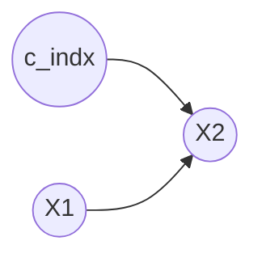

# 02 约束型方法深入：PC / FCI / CD-NOD（含 MVPC 缺失值版）

> 一句话定位：约束型方法 =「用条件独立性检验，一步步删边 + 定向」。本篇把因果发现的三大经典约束方法——PC（无隐变量）、FCI（允许隐变量）、CD-NOD（时变/异质数据）——的假设、算法、API、输出语义全部讲透，并给出可复现的真实运行示例。

---

## 🔗 约束型方法的共同逻辑：骨架 + 碰撞器 + Meek 规则

PC / FCI / CD-NOD 都遵循同一个三步框架：

```
第 1 步  骨架发现 Skeleton Discovery
         从完全图开始，逐对检验 X ⊥ Y | S（S ⊂ 邻居集）
         → 独立就删边，留下「骨架」（无向图）
第 2 步  碰撞器定向 Unshielded Collider Orientation
         找「X — Y — Z」且 X、Z 不相邻的三元组
         若 X ⊥̸ Z | S（且 Y ∈ S）→ 定向 X → Y ← Z
第 3 步  Meek 规则定向传播
         用 4 条局部规则把剩下的无向边尽量定向（不引入新的对撞/环）
```

差别只在「第 1 步怎么删、第 2 步怎么定、能容忍什么样的数据」。

---

## ① PC：无隐变量时的默认首选

### 核心思想与假设

PC（Peter-Clark）假设数据满足：
- **因果充分性**：所有共同原因都被观测到了（**没有隐变量**）——这是 PC 最脆弱的一环；
- **忠实性**：独立性完全由图决定，没有巧合的独立；
- **因果马尔可夫性**：图蕴含的独立性分布必须满足；
- **同分布**：样本独立同分布（不随时间/域变化）。

**输出：CPDAG**。有向边 = 等价类内方向唯一；无向边 = 方向未定。

### 图矩阵编码（读懂 `cg.G.graph`）

| 编码 | 含义 |
|---|---|
| `graph[j,i]=1, graph[i,j]=-1` | `i --> j`（有向边）|
| `graph[i,j]=graph[j,i]=-1` | `i --- j`（无向边）|
| `graph[i,j]=graph[j,i]=1` | `i <-> j`（双向，PC 一般不出现）|

### API 与参数逐个讲

```python
from causallearn.search.ConstraintBased.PC import pc
cg = pc(data, alpha, indep_test, stable, uc_rule, uc_priority,
        mvpc, correction_name, background_knowledge, verbose,
        show_progress, node_names, max_k, cache_path=..., **kwargs)
```

| 参数 | 默认 | 含义 |
|---|---|---|
| `data` | 必填 | `(n_samples, n_features)` 的 ndarray |
| `alpha` | `0.05` | 独立性检验显著性水平 |
| `indep_test` | `'fisherz'` | 检验：`fisherz / chisq / gsq / kci / mv_fisherz` |
| `stable` | `True` | **稳定版骨架发现**（Colombo & Maathuis 2014）：删边顺序无关，结果对变量顺序不敏感 |
| `uc_rule` | `0` | 碰撞器定向规则：`0=uc_sepset`、`1=maxP`（用额外检验）、`2=definiteMaxP`（只定「确定碰撞器」）|
| `uc_priority` | `2` | 定向冲突解决：`-1` 默认、`0` 覆盖、`1` 定向双向、`2` 优先已有碰撞器、`3` 优先更强碰撞器、`4` 更强* |
| `mvpc` | `False` | 是否用**缺失值 PC**（配 `mv_fisherz`）|
| `correction_name` | `'MV_Crtn_Fisher_Z'` | 缺失值校正方法 |
| `background_knowledge` | `None` | 先验知识：强制/禁止某些边 |
| `verbose` | `False` | 打印详细过程 |
| `show_progress` | `True` | 显示进度条 |
| `node_names` | `None` | 自定义节点名（0.1.4.8 新增）|
| `max_k` | `None` | 条件集最大阶数上限（限制检验阶数，加速；0.1.4.8 新增）|
| `cache_path` | `None` | p 值缓存 JSON 路径，重跑/调参免重复计算（KCI 必用）|

### 最小可运行示例（5 节点线性高斯，seed=42）

```python
import numpy as np
from causallearn.search.ConstraintBased.PC import pc
from causallearn.utils.cit import fisherz

np.random.seed(42)
n = 2000
# 真值 DAG：0→1→2→4, 0→3, 1→3, 2→3, 3→4（TestPC.py 基准图）
B = np.zeros((5, 5))
for i, j in [(0,1),(0,3),(1,2),(1,3),(2,3),(2,4),(3,4)]: B[i, j] = 0.7
X = np.random.randn(n, 5)
for j in range(5):
    for i in range(5):
        if B[i, j]: X[:, j] += B[i, j] * X[:, i]

cg = pc(X, 0.05, fisherz, show_progress=False)
print('耗时 %.3fs' % cg.PC_elapsed)
print('有向边:', sorted(cg.find_fully_directed()))   # 与真值 CPDAG 一致
print('无向边:', sorted(cg.find_undirected()))
print(cg.G.graph)
```

**运行输出**（本机实测）：

```
耗时 0.024s
有向边: [(0, 3), (1, 3), (2, 3), (2, 4), (3, 4)]
无向边: [(0, 1), (1, 0), (1, 2), (2, 1)]
[[ 0 -1  0 -1  0]
 [-1  0 -1 -1  0]
 [ 0 -1  0 -1 -1]
 [ 1  1  1  0 -1]
 [ 0  0  1  1  0]]
```

结果与官方 `TestPC.py` 对该基准图的期望 CPDAG **完全一致**：对撞 `0→3←1`、`1→3←2` 被定向，`0—1—2` 方向未定（等价类）。评估时用 `dag2cpdag` 把真值 DAG 转 CPDAG 再算 SHD。

---

## ② FCI：允许隐变量，输出 PAG

### 核心思想与假设

FCI（Fast Causal Inference）放宽了 PC 最严格的假设——**允许未观测的共同原因（隐变量）和选择偏差**。它在骨架阶段之后额外做 **possible d-sep 集合** 判定，用更保守的规则定向，得到 **PAG（部分祖先图）**。

假设：
- **允许隐变量**（放弃因果充分性）；
- 其余与 PC 相同：忠实性、马尔可夫性、同分布。

### PAG 的三类端点标记（重点）

PAG 的每条边两端各有三种标记，组合起来表达「这个端点到底是因果源头还是未知」：

| 端点标记 | 图例 | 含义 |
|---|---|---|
| 箭头 ARROW | `→` / `←` | 该端**确定**是箭尾（原因端）或箭头（结果端）|
| 箭尾 TAIL | `—` | 该端**确定**没有隐变量在搞鬼（可见边）|
| 圆圈 CIRCLE | `o` | **未知**：可能是箭头也可能是箭尾（可能存在隐变量）|

常见组合解读：

| 组合 | 含义 |
|---|---|
| `X → Y` | 因果方向确定，且**无隐变量**介入 |
| `X o→ Y` | 有因果，但可能被隐变量混淆 |
| `X ↔ Y` | 存在**隐共同原因**（双向因果的标记，不是真的互指）|
| `X o-o Y` | 有边，但两端都不确定（最保守）|

### FCI 的 `edges` 属性：nl / dd / pl / pd

`fci` 返回 `(G, edges)`，`edges` 里每条边带 `properties` 标记，**直接回答「这条边有多可信」**：

| 属性 | 含义 |
|---|---|
| `nl`（no latent）| 该边**无隐变量**混淆（「可见边」，可放心解读方向）|
| `dd`（definitely direct）| **确定直接**因果（没有中间隐变量）|
| `pl`（possibly latent）| **可能存在**隐变量混淆 |
| `pd`（possibly direct）| 可能**不是**直接因果（可能被中间隐变量传导）|

> 一条边可以同时带多个属性，如 `['pd','pl']` = 「可能非直接 + 可能被混淆」——FCI 的诚实表达。

### API 与参数

```python
from causallearn.search.ConstraintBased.FCI import fci
G, edges = fci(dataset, independence_test_method, alpha, depth,
               max_path_length, verbose, background_knowledge,
               node_names, show_progress)
```

| 参数 | 默认 | 含义 |
|---|---|---|
| `dataset` | 必填 | `(n_samples, n_features)` |
| `independence_test_method` | `'fisherz'` | 检验方法（同 PC）|
| `alpha` | `0.05` | 显著性水平 |
| `depth` | `-1` | 快速邻接搜索深度，`-1` 不限（限制可大幅加速）|
| `max_path_length` | `-1` | 判别路径最大长度，`-1` 不限 |
| `background_knowledge` | `None` | 先验知识 |
| `show_progress` | `True` | 进度条 |

### 最小可运行示例（含隐变量 L 混淆 X1、X2）

```python
import numpy as np
from causallearn.search.ConstraintBased.FCI import fci
from causallearn.utils.cit import fisherz

np.random.seed(42)
n = 2000
L  = np.random.randn(n)                      # 未观测的共同原因
X1 = 0.8 * L + 0.6 * np.random.randn(n)
X2 = 0.8 * L + 0.6 * np.random.randn(n)      # X1、X2 被 L 混淆
X3 = 0.7 * X1 + np.random.randn(n)
X4 = 0.7 * X2 + np.random.randn(n)
X5 = 0.6 * X3 + 0.6 * X4 + np.random.randn(n)
obs = np.column_stack([X1, X2, X3, X4, X5])

G, edges = fci(obs, fisherz, 0.05, verbose=False, show_progress=False)
print(G.graph)
for e in edges:
    props = [str(p).split('.')[-1] for p in e.properties]
    print(f'{e.get_node1().get_name()} {e.get_endpoint1()} {e.get_endpoint2()} '
          f'{e.get_node2().get_name()}  props={props}')
```

**运行输出**（本机实测）：

```
[[ 0  2  2  0  0]
 [ 2  0  0  2  0]
 [ 2  0  0  0 -1]
 [ 0  2  0  0 -1]
 [ 0  0  1  1  0]]
X1 CIRCLE CIRCLE X2  props=[]
X1 CIRCLE CIRCLE X3  props=[]
X2 CIRCLE CIRCLE X4  props=[]
X3 TAIL ARROW X5  props=['pd', 'pl']
X4 TAIL ARROW X5  props=['pd', 'pl']
```

**怎么读**：真值结构是 `X1↔X2`（L 混淆）+ `X1→X3, X2→X4, X3→X5, X4→X5`。FCI 的估计是保守的：
- `X1 o-o X2`：正确地**没有**把 X1-X2 定向成单向边——圆圈表达「这里可能藏着隐变量」；
- `X1 o-o X3`、`X2 o-o X4`：方向未定（等价类内）；
- `X3 → X5`、`X4 → X5`：方向确定，但 `['pd','pl']` 提醒「可能非直接 + 可能被混淆」。
这就是 PAG 相比 CPDAG 的「诚实度」：宁可给圆圈，不假装知道。

---

## ③ CD-NOD：时变 / 异质数据的「增广 PC」

### 核心思想

CD-NOD（Causal Discovery from Nonstationary/Heterogeneous Data）针对**分布随时间或环境变化**的数据。做法很优雅：把「时间/域索引」当作一个**虚拟节点 `c_indx`** 拼进数据，跑一遍 PC 的增广版——如果某个变量的机制在变化，它就会与 `c_indx` 连边，从而把「变化」纳入因果图。



上图的含义：`X2` 的生成机制随时间变化（`C → X2`），而 `X1 → X2` 的因果方向仍被识别。参数变化本身被当作一个「原因」。

### API 与 `c_indx` 用法

```python
from causallearn.search.ConstraintBased.CDNOD import cdnod
cg = cdnod(data, c_indx, alpha, indep_test, stable, uc_rule,
           uc_priority, mvcdnod, correction_name, ...)
```

| 参数 | 说明 |
|---|---|
| `data` | `(n_samples, n_features)` |
| `c_indx` | **必填**，`(n_samples, 1)` 的时间或域索引 |
| `indep_test` | 官方建议：`c_indx` 是时间索引时用 **`kci`**（时间连续值）|
| `mvcdnod` | 缺失值版 CD-NOD |
| 其余 | 同 PC |

`c_indx` 两种典型构造：
- **时变**：`c_indx = np.arange(n).reshape(-1, 1)`（第 t 行 = t）；
- **域变**（多环境拼一起）：域 1 全填 1、域 2 全填 2、……。

### 最小可运行示例（机制分段切换，kci）

```python
import numpy as np
from causallearn.search.ConstraintBased.CDNOD import cdnod
from causallearn.utils.cit import kci

np.random.seed(42)
T = 600
x1 = np.random.randn(T)
x2 = np.concatenate([0.9*x1[:T//2] + 0.5*np.random.randn(T//2),   # 前段: 强因果
                     0.1*x1[T//2:] + 0.5*np.random.randn(T-T//2)]) # 后段: 弱因果
data = np.column_stack([x1, x2])
c_indx = np.arange(T).reshape(-1, 1)     # 时间索引

cg = cdnod(data, c_indx, 0.05, kci, True, 0, -1, show_progress=False)
print(cg.G.graph)   # 注意：最后一列 = c_indx 节点
```

**运行输出**（本机实测，耗时约 1.4s）：

```
[[ 0 -1  0]
 [ 1  0  1]
 [ 0 -1  0]]
```

解码：`X1 → X2`（0→1），**`C → X2`（2→1）**——CD-NOD 既恢复了因果方向，又准确指向了「机制在变化」的变量 X2。这正是它相对普通 PC 的增量价值。

### MVPC：缺失值数据的处理

`pc(..., mvpc=True)` + `mv_fisherz` 即可在**含 NaN** 的数据上跑 PC：
- **testwise deletion**（`mv_fisherz` 的默认）：检验哪几个变量就用哪几列里没缺失的样本；
- **MVPC**（`mvpc=True`）：更完整地利用缺失信息，配 `correction_name`。

```python
import numpy as np
from causallearn.search.ConstraintBased.PC import pc
from causallearn.utils.cit import mv_fisherz

np.random.seed(42)
X_missing = X.copy()
X_missing[np.random.rand(*X.shape) < 0.2] = np.nan    # 打 20% 缺失
cg = pc(X_missing, 0.05, mv_fisherz, True, 0, 4, mvpc=True, show_progress=False)
print(cg.G.graph)
```

**运行输出**：得到与原图一致的 7 条边的骨架（`graph[i,j]=graph[j,i]=-1` 为无向边），但因缺失导致方向多数未定——这是缺失值场景的典型代价（信息少了，方向定不出来）。

---

## 🎯 独立性检验搭配建议

| 数据 | 推荐检验 | 理由 |
|---|---|---|
| 连续 + 线性 + 高斯 | **`fisherz`** | 偏相关检验，精确且快 |
| 连续 + 非线性 / 非高斯 | **`kci`** | 核方法，非参数（O(n³)，慢）|
| 离散 | **`chisq` / `gsq`** | 列联表 / 似然比检验 |
| 含缺失值 | **`mv_fisherz`** | testwise deletion + MVPC |
| 大图 / 慢检验 | 配 **`cache_path`** | p 值落盘，重跑免算 |

---

## ⚠️ 局限（务必记住）

1. **PC 假设无隐变量**——有未观测共同原因时，PC 会把隐变量的混淆误判为直接边，甚至方向反掉。→ 换 FCI。
2. **fisherz 只对线性高斯成立**——非线性数据用它会出现假条件独立/假边。→ 换 kci。
3. **KCI 极慢**——样本量上千就要几分钟起步（O(n³)），务必 `cache_path` 或降采样。
4. **PC 只能到 CPDAG**——等价类内的方向是数据极限，别指望 PC 全定出来。
5. **FCI 很保守**——圆圈端点很多，解读时别把圆圈当「没结果」，它是「不确定」。
6. **CD-NOD 的 `kci` 在时间索引上**——时间索引是连续值，fisherz 线性假设不合理，官方明确建议 kci。

---

## 📚 参考（官方文档路径）

- `D:\win\causal-learn\docs\source\search_methods_index\Constraint-based causal discovery methods\PC.rst`
- `D:\win\causal-learn\docs\source\search_methods_index\Constraint-based causal discovery methods\FCI.rst`
- `D:\win\causal-learn\docs\source\search_methods_index\Constraint-based causal discovery methods\CDNOD.rst`
- `D:\win\causal-learn\docs\source\independence_tests_index\fisherz.rst` / `chisq.rst` / `gsq.rst` / `kci.rst` / `mvfisherz.rst`
- `D:\win\causal-learn\causallearn\search\ConstraintBased\PC.py`、`FCI.py`、`CDNOD.py`（源码，参数与边属性权威定义）
- `D:\win\causal-learn\tests\TestPC.py`、`TestFCI.py`、`TestCDNOD.py`（官方学习用例与基准图）

## ✅ 验证输出

本文 4 个示例（PC / FCI / CD-NOD / MVPC）全部在本机实跑通过，运行输出见各示例代码块后的「运行输出」。集中复现脚本：`experiments/00_env_check.py`。运行命令：

```bash
cd D:/win/causal-lab
PYTHONPATH= D:/Anaconda/envs/pytorch/python.exe experiments/00_env_check.py
```

> ⚠️ 环境注意：官方 `tests/TestFCI.py` 里的 `d_separation` 检验在本环境不可用（networkx 3.2.1 缺 `is_d_separator`），上述示例一律用真实数据 + `fisherz / kci / mv_fisherz`。
