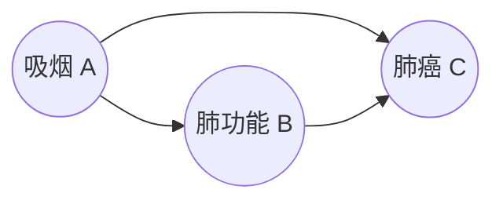
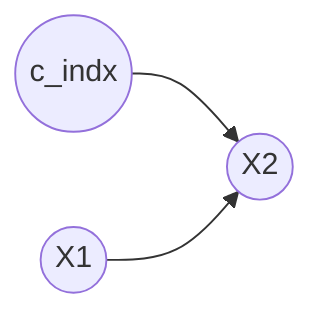

# 因果推断方法体系与实证总览

> **副标题**：causal-learn 全仓库系统梳理 —— 13 个方法、9 篇知识库、13 组实验、17 份指标 JSON 的完整总账
>
> **仓库**：<https://github.com/zqian6263-design/causal-inference>
> **引擎**：causal-learn 0.1.4.8（CMU CLeaR / py-why 官方因果发现库）· Python 3.9 · 纯 CPU
> **文档版本**：2026-09-22 · 对应 commit `93b602d`

---

## 关于本文档

### 读者与读法

本文档是**两层结构**，请按需跳读：

| 层 | 章节 | 读者 | 读法 |
|---|---|---|---|
| **体系篇** | 第 0–6 章 | 导师、评审、非技术读者、刚开始接触因果推断的人 | **零代码可读**。只讲"解决什么问题 / 有哪些方法 / 跑出来什么结果 / 怎么选"，公式只出现在必要处且不推导 |
| **工程篇** | 第 7–12 章 + 附录 | 会用 Python、要复现或接手的人 | API 签名、参数表、图矩阵编码、评估口径、踩坑实录、逐实验索引 |

**如果你只有 10 分钟**：读第 0 章（一页速览）+ 第 5.3 节（六条实证结论）+ 第 6.1 节（选型决策树）。
**如果你要上手跑**：直接跳到第 11 章（模板三步走）。
**如果你要审数字**：跳到附录 D（数据溯源表），每个数值都能回溯到 `results/metrics/` 下的具体 JSON 文件。

### 可靠性声明（重要）

这份文档的写作纪律，是本仓库一贯纪律的延续：

1. **文档中每一个数值都来自 `results/metrics/*.json`，不是转述、不是估算、不是记忆。** 附录 D 给出「结论 → 源文件 → 字段名」的完整映射。
2. **区分「合成数据结论」与「真实数据结论」。** 合成数据有真值图，可以算 SHD 等定量指标；真实数据集（sachs 等）没有真值图，只能做结构演示和稳定性检验，**不做定量评估**。全文严格标注。
3. **区分「强结论」与「弱结论」。** 第 5.11 节专门做可信度自评，明确哪些结论可以引用、哪些只是单次观察。
4. **负面结果照实写。** 本文档包含大量"这个方法在这里不如另一个"的记录（如 KCI 大样本仍不保证恢复、FCI 与官方基准 5/14 一致、大图 PC 严重退化）。**这些不是失败记录，是选型依据**——知道方法在哪里失效，和方法在哪里有效同样重要。
5. **已知的内部矛盾已修正并在文中标注。** 本仓库历史上出现过若干被后续实验推翻的结论（如"线性高斯下 PC/GES 完美恢复"实为单 seed 运气、"BOSS 离散优势归因于 BDeu"实为归因错误）。本文档记录的是**修正后**的结论，并在第 5.11 节列出被推翻的旧说法，供读者识别过期资料。

> ⚠️ **注意**：仓库内 `GUIDE.md`、`knowledge/` 的个别早期小节仍残留旧的单 seed 说法（如"线性高斯实测 SHD=0"、"离散 BOSS SHD=1"、"GRaSP 无 seed 参数结果随机"）。**这些已被多 seed 实验推翻**，请以本文档与 `knowledge/08-方法选型指南.md` ②b 节为准。详见第 5.11 节。

---

## 目录

**体系篇**

- [第 0 章 一页速览](#第-0-章-一页速览)
- [第 1 章 因果推断解决什么问题](#第-1-章-因果推断解决什么问题)
- [第 2 章 理论基础：DAG、d-分离、等价类](#第-2-章-理论基础dagd-分离等价类)
- [第 3 章 方法体系全景](#第-3-章-方法体系全景)
- [第 4 章 方法逐个讲（概念层）](#第-4-章-方法逐个讲概念层)
- [第 5 章 实证结果：这些数字说明什么](#第-5-章-实证结果这些数字说明什么)
- [第 6 章 选型决策地图](#第-6-章-选型决策地图)

**工程篇**

- [第 7 章 仓库地图与复现指南](#第-7-章-仓库地图与复现指南)
- [第 8 章 causal-learn API 手册](#第-8-章-causal-learn-api-手册)
- [第 9 章 评估与工程实践](#第-9-章-评估与工程实践)
- [第 10 章 实验索引（13 组）](#第-10-章-实验索引13-组)
- [第 11 章 模板：新任务三步走](#第-11-章-模板新任务三步走)
- [第 12 章 已知限制与诚实声明](#第-12-章-已知限制与诚实声明)

**附录**

- [附录 A 术语表](#附录-a-术语表)
- [附录 B 指标口径速查](#附录-b-指标口径速查)
- [附录 C 文件清单](#附录-c-文件清单)
- [附录 D 数据溯源表](#附录-d-数据溯源表)
- [附录 E 参考来源](#附录-e-参考来源)

- [结语](#结语)

---
---

# 体系篇

---

## 第 0 章 一页速览

### 0.1 这个仓库是什么

一句话：**把 causal-learn（CMU CLeaR 官方因果发现库）从官方文档到可运行实验全量梳理一遍，产出一个「拿到任何因果数据分析任务，照着选方法、抄模板就能跑」的知识库 + 实验证据库。**

具体产出：

| 产出 | 数量 | 位置 |
|---|---|---|
| 中文知识库 | 9 篇（1496 行） | `knowledge/` |
| 方法实验 | 13 组（覆盖 14 个方法入口） | `experiments/01`–`11` |
| 指标 JSON | 17 份（+8 份 gitignore 的缓存） | `results/metrics/` |
| 实证图表 | 14 张 PNG | `results/figs/` |
| 通用分析模板 | 2 套（通用 + 遥感案例） | `experiments/10_templates/`、`experiments/demo_remote_sensing/` |
| CI 冒烟 | 1 条工作流（新鲜 clone → pip install → 全跑通） | `.github/workflows/smoke.yml` |

覆盖的方法：**PC / FCI / CD-NOD / MVPC / GES / DGES / ExactSearch / LiNGAM 家族（ICA·Direct·VAR·RCD·CAM-UV）/ ANM / PNL / GIN / RLCD / BOSS / GRaSP / Granger**，以及 5 种独立性检验（`fisherz` / `chisq` / `gsq` / `kci` / `mv_fisherz`）与 4 类打分函数（`BIC` / `BDeu` / `CV_general` / `marginal_general`）。

### 0.2 十张核心结论卡

以下十句话，是全文的浓缩。每条都在第 5 章有数据支撑，附录 D 可溯源。

| # | 结论 | 依据 |
|---|---|---|
| 1 | **因果发现只能给到「等价类」为止。** 除非叠加函数形式假设，否则方向在观测数据里不可识别——这不是算法缺陷，是信息上限 | 第 2.4 节 |
| 2 | **线性高斯连续数据：BOSS+BIC 是唯一多 seed 稳定完美的**（SHD 0.00±0.00，5 seed 全对）；PC/GES/GRaSP 平均 4.8–6.6 | `comparison.json` |
| 3 | **线性非高斯连续数据：ICA-LiNGAM 是唯一能精确恢复完整 DAG 的**（SHD 0.00±0.00，含完整箭头），且样本量 1000→30000 全程稳定 | `comparison.json`、`sensitivity.json` |
| 4 | **非线性数据：所有线性假设方法一律失效**（SHD ≥ 4.4）。首选「PC 找骨架 + ANM/PNL 成对定向」，**不要指望 KCI 救场** | `comparison.json`、`kci_large.json` |
| 5 | **离散数据的结论随生成口径翻转**——这是全项目最大教训。高斯分箱→BOSS+BIC；真实 bnlearn 网络中小规模→BOSS+BDeu；纯 logit 小图→PC+chisq。**任何离散结论都必须标注生成方式与图规模** | `discrete_cpd.json`、`bnlearn_all.json` |
| 6 | **大样本不等于更稳。** 30000 样本下 PC/GES/GRaSP/BOSS 全部出现「2/3 seed 完美、1 seed 全错」（SHD [0,7,0]）——高方差来自贪婪局部最优，不是样本量不足 | `sensitivity.json` |
| 7 | **KCI 大样本不是解药。** 非线性场景 5000 样本 SHD 仍为 5（漏 1 边），代价是 4160 秒/数据集；线性场景 5000 样本才完美，耗时 5612 秒 | `kci_large.json` |
| 8 | **排列型方法必须多 seed。** GRaSP/BOSS 内部有随机性，同数据不同 seed 的 SHD 可差 8（1→9）。单 seed 对比结论一律不可信 | `comparison.json` |
| 9 | **代码实现正确性已与官方基准逐位对照**：PC+chisq 在 bnlearn 13 集上 **13/13 逐位一致**；GES 在合成 10 节点上 **2/2 一致**；FCI **5/14 一致**（差异是官方 PAG 定向规则的版本漂移，非实现错误） | `compare_official.json` |
| 10 | **因果特征选择有实测价值**：Y 的马尔可夫毯只用 2 个特征，达到与全 5 特征相同的分类准确率（0.935±0.003），且剔除了被相关筛选骗进来的伪相关特征 | `markov_blanket.json` |

### 0.3 这个仓库最诚实的一句话

> **因果发现不是一个"跑一下就有答案"的工具箱。**它给你的是：在明确假设下、在信息上限内、可复现的一张图，外加一组告诉你不确定在哪的标记（CPDAG 的无向边、PAG 的圆圈端点、FCI 的 `pd`/`pl` 属性、CAM-UV 的 U 列表）。
>
> 把它当作**假设检验的探针**和**领域知识的对照工具**，而不是"因果真相机"。本仓库所有负面结论，本质上都在反复印证这句话。

---

## 第 1 章 因果推断解决什么问题

### 1.1 相关 ≠ 因果：一个具体的例子

用本仓库遥感案例（`experiments/demo_remote_sensing/`）里的结构来说明，因为它把问题暴露得最干净：

```
X3(土壤湿度) ──→ X1(NDVI 植被指数) ──→ Y(作物产量)
     ├────────────────────────────────→ Y
     └──→ X4 ──→ X5          （X4/X5 与 Y 无因果，但经 X3 有共因相关）
X2(波段噪声) ──── 与 Y 无关（纯伪特征）
```

如果你只看相关系数，会看到 X1 与 Y 高度相关，于是得出"提高植被指数就能增产"。但这个相关里有很大一块是 **X3（土壤湿度）的贡献**——土壤湿度同时推高了植被指数和产量，是两个变量共同的"幕后推手"。

这就是**混杂（confounding）**：`X1 ← X3 → Y` 这条路径让 X1 与 Y 产生了与因果无关的关联。把这条路径的贡献剥掉，剩下的才是 X1→Y 的真实因果效应。

注意一个关键点：**X2 与 Y 完全无关，但在有限样本下它也会有非零相关系数**。仅凭"相关系数大"做特征筛选，既会保留 X1 这种真因果（好事），也会保留 X4/X5 这种"经共因相关"的伪因果（坏事）——本仓库的马尔可夫毯实验（第 5.9 节）正是拿这个差异做了定量对比。

### 1.2 从"看见"到"干预"：因果之梯

Judea Pearl 把因果问题分成三个层级，层次不可跨越——**高层的量无法从底层数据单独算出来**，必须额外引入因果结构假设：

| 层级 | 典型问题 | 数学表达 | 仅靠观测数据能回答吗 |
|---|---|---|---|
| **1. 关联 Association** | 看到 X，Y 会是多少？ | `P(Y \| X)` | ✅ 能 |
| **2. 干预 Intervention** | 如果强行把 X 设成某个值，Y 会变吗？ | `P(Y \| do(X))` | ❌ 不能，除非有因果图 + 可识别性条件 |
| **3. 反事实 Counterfactual** | 已经发生的事，如果当时不一样，会怎样？ | `P(Y_{X=x'} \| X=x, Y=y)` | ❌ 不能，需更强假设 |

**这解释了因果发现为什么重要**：它是在为第 2、3 层的问题搭建必需的脚手架。有了图（哪怕只是等价类），才谈得上识别 `do` 算子、做后门/前门调整、选工具变量。

### 1.3 与本仓库范围的划界（重要，避免误解）

因果推断领域实际有**两大块**，本仓库只做了第一块：

| | **因果发现**（Causal Discovery） | **因果效应估计**（Causal Effect Estimation） |
|---|---|---|
| 问题 | 变量之间的因果**结构**是什么？ | 已知结构或处理变量，效应**有多大**？ |
| 输出 | 一张图（DAG / CPDAG / PAG） | 一个数（ATE / CATE）或一条曲线 |
| 典型方法 | PC、GES、LiNGAM…（**本仓库全部内容**） | 倾向得分、双重稳健、DML、合成控制… |
| 本仓库 | ✅ 全覆盖 | ❌ **不在范围内** |

**换句话说**：本仓库教的是"谁导致谁"，不是"导致了多少"。第 12.4 节会明确列出这类范围边界。如果你的任务是估计某政策的效应量，本仓库的方法能帮你**画图找混杂**（这是效应估计的第一步），但效应量本身要用另一套工具算。

### 1.4 为什么需要算法，而不只是领域知识

有人会问：既然图应该由领域知识给，为什么还要算法？

三个理由：

1. **变量多的时候人脑不够用**。20 个变量有 4.2×10¹⁸ 个可能的有向无环图，靠人脑枚举不现实。
2. **算法能证伪你的假设**。领域知识给出的图，可能和数据的条件独立关系**矛盾**——算法会明确告诉你矛盾在哪，这是把"专家意见"变成"可检验假设"的关键一步。
3. **算法能标注不确定性**。PC 的无向边、FCI 的圆圈端点，是在告诉你"这里的数据不足以定方向"——这比一个自信但错误的箭头有用得多。

**正确用法**：算法给出候选图 + 不确定性标记 → 用领域知识核对关键边 → 拿不准的边标注为待验证 → 设计后续干预实验或补充数据。**算法不是替代专家，是给专家一个可反驳的草稿。**

---

## 第 2 章 理论基础：DAG、d-分离、等价类

本章是理解后续所有方法的地基。如果时间紧，只需记住 **2.3 节的 d-分离规则表** 和 **2.4 节的等价类结论**。

### 2.1 因果图（DAG）与基本术语

因果推断用**有向无环图（Directed Acyclic Graph, DAG）**表示因果关系：节点 = 变量，有向边 = 直接因果。



- **有向**：边带箭头，方向不可反推。
- **无环**：不允许 A→B→A（原因不能是自身的结果）。
- **没有边 ≠ 没关系**：只表示没有**直接**因果，间接因果通过路径体现。

| 术语 | 含义 | 例子（上图） |
|---|---|---|
| 父节点 parent | 有边直接指向它的节点 | A 是 B、C 的父 |
| 子节点 child | 被它直接指向的节点 | B、C 是 A 的子 |
| 祖先 ancestor | 沿有向边可到达它的节点 | A 是 C 的祖先 |
| 后代 descendant | 从它沿有向边可到达的节点 | C 是 A 的后代 |
| 路径 path | 连通的边序列（不管方向） | A—B—C |
| 有向路径 directed path | 方向一致的路径 | A→B→C |
| 对撞子 collider | 两条边都指向它的节点 | 若 A→B←C，则 B 是对撞子 |

### 2.2 三种原子结构

任意 DAG 的局部关系都可拆成三种基本结构，它们决定了 d-分离规则：

```
链  Chain      A ──▶ B ──▶ C      （B 是中间传导者）
叉  Fork       A ◀── B ──▶ C      （B 是共同原因）
对撞 Collider  A ──▶ B ◀── C      （B 是碰撞器）
```

### 2.3 d-分离规则表（核心）

**d-分离**回答：在给定条件集 S 的情况下，X 和 Y 在图上还有没有"通路"？

| 路径类型 | 何时**开放**（连通 → 相关） | 何时**阻断**（d-分离 → 独立） |
|---|---|---|
| 链 A→B→C | B ∉ S | **B ∈ S** |
| 叉 A←B→C | B ∉ S | **B ∈ S** |
| 对撞 A→B←C | **B ∈ S**（或 S 含 B 的后代） | B ∉ S |

一句话记忆：**链和叉「条件在中间节点上就断」，对撞「条件在中间节点上反而通」**。对撞的反直觉之处正是伯克森悖论（Berkson's paradox）的来源——「才华」和「颜值」本来独立，但只看「成名的人」，两者就负相关了。

**这张表为什么是全章最关键的**：约束型方法（PC/FCI/CD-NOD）的全部逻辑就是——用条件独立检验反推 d-分离关系，再反推图。表中的三行对应了骨架发现（删边）和碰撞器定向（定方向）两个算法步骤的全部理论依据。

### 2.4 马尔可夫等价类：为什么方向不一定学得出来（本章结论）

**定义**：两个 DAG 如果**骨架相同**且**对撞结构相同**，就属于同一个马尔可夫等价类——它们蕴含的独立性完全相同，**任何观测数据都无法区分谁真谁假**。

本仓库用可运行实验验证了这一点（`knowledge/00`，seed=42，n=3000，线性高斯）：

```
A->B->C  -> CPDAG 有向边: [] 无向边: [(0,1),(1,0),(1,2),(2,1)]
A<-B<-C  -> CPDAG 有向边: [] 无向边: [(0,1),(1,0),(1,2),(2,1)]
A<-B->C  -> CPDAG 有向边: [] 无向边: [(0,1),(1,0),(1,2),(2,1)]
A->B<-C  -> CPDAG 有向边: [(0,1),(2,1)] 无向边: []
```

**三个方向完全不同的链，PC 输出同一个 CPDAG**；唯独带对撞的 `A→B←C` 能被唯一定向。

**三个直接推论**：

1. **"为什么 PC 只给 CPDAG" 不是缺陷，是信息上限。** 等价类内由数据无法区分的方向，PC 留着无向边——这是诚实的表达。
2. **想拿到完整 DAG，必须额外加假设。** 函数因果模型（LiNGAM/ANM/PNL）之所以能给出完整 DAG，是因为它们额外假设了「噪声非高斯」或「加性噪声 + 非线性」——用假设换信息。这是第 3.3 节三大范式差异的根源。
3. **评估时真值必须先转成同语义的图。** 真值 DAG 直接对比 CPDAG 会因"比等价类更具体"而 SHD 虚高。本仓库统一用 `dag2cpdag`（约束型/打分型）、`dag2pag`（FCI）对齐。这是最容易犯的评估错误，见第 9.1 节。

### 2.5 CPDAG / PDAG / PAG：三种"把等价类画出来"的方式

| 图 | 全称 | 端点标记 | 允许隐变量 | 谁输出它 |
|---|---|---|---|---|
| **CPDAG** | 完全部分有向无环图 | 有向边 `→`、无向边 `—` | 否 | PC、GES、BOSS、GRaSP |
| **PDAG** | 部分有向无环图 | 有向边、无向边（允许"不完全"） | 否 | 中间产物 |
| **PAG** | 部分祖先图 | `→`、`—`、圆圈 `o` | **是** | FCI |

- **CPDAG**：每个等价类唯一对应一个 CPDAG。有向边 = 所有等价类成员方向一致；无向边 = 方向未定。
- **PAG**：多一种「圆圈端点」`o`，表示该端点"可能是箭尾也可能是箭头"。PAG 的端点语义详见第 4.1 节。

### 2.6 结构性因果模型（SCM）：三大范式的共同出发点

SCM 是因果发现的理论基础——数据不是凭空产生的，而是由一个「真值图 + 机制」生成：

```
X_i = f_i( Pa(X_i), U_i )     i = 1, ..., d
       │        │      └── 外生噪声（互相独立）
       │        └────────── X_i 的父节点（来自 DAG）
       └──────────────── 机制 f_i（线性 / 非线性 / 任意函数）
```

**为什么懂 SCM 有用**：

1. 本仓库所有的合成数据实验（`scripts/data_gen.py`）本质上都是在"选一个 SCM 采样"。
2. **三大范式的本质差异 = 对 SCM 的假设强度不同**：
   - 约束型只假设「独立同分布 + 忠实性」（最弱，所以最通用，但也最受限）
   - 打分型假设「似然可计算且可分解」（中等）
   - 函数模型假设「具体函数形式（线性/加性/后非线性）」（最强，所以能识别方向，但也最脆）
3. **这一条解释了本文档最重要的一个模式**：所有"某方法在某场景失败"的记录，追根到底都是**该场景违反了它的 SCM 假设**。ICA-LiNGAM 在高斯数据上不收敛（违反非高斯假设）、GES 在确定性数据上退化（违反噪声假设）、fisherz 在非线性数据上出假边（违反线性高斯假设）——全是同一回事。

---

## 第 3 章 方法体系全景

### 3.1 六大类分类图

causal-learn 0.1.4.8 的方法按搜索策略分成 6 大类（与官方文档 `search_methods_index` 的 6 个 toctree 对应）：

```
因果发现搜索方法 (search_methods_index/)
├── ① 约束型 Constraint-based        → PC、FCI、CD-NOD
├── ② 打分型 Score-based             → GES、DGES、ExactSearch
├── ③ 函数因果模型 Constrained FCM   → LiNGAM 家族、ANM、PNL
├── ④ 隐变量表示 HiddenCausal        → GIN、RLCD
├── ⑤ 排列型 Permutation-based       → BOSS、GRaSP
└── ⑥ 时序 Granger causality         → Granger（回归检验 + Lasso）
```

> 「13 个搜索方法」的口径 = ①~⑤ 共 13 个入口（LiNGAM 家族算 1 个入口，内含 ICA / Direct / VAR / RCD / CAM-UV 五个变体）；Granger 单独归为「时序因果检验」而非图搜索方法，所以合计是 **13 + 1**。

### 3.2 方法总览表（13 + 1）

> 时间成本量级的定性口径：**快** = 秒级内搞定中小图；**中** = 几分钟；**慢** = 小样本也要算半天（如 KCI 的 O(n³)）；**精确** = 节点数稍多就指数爆炸。

| # | 方法 | 范式 | 核心假设 | 输出语义 | 时间量级 | 典型适用场景 |
|---|---|---|---|---|---|---|
| 1 | **PC** | 约束型 | 无隐变量、忠实性 | CPDAG | 快~中 | 线性/离散数据的默认首选，图不大、变量全观测 |
| 2 | **FCI** | 约束型 | 允许隐变量、选择偏差 | PAG | 中~慢 | 怀疑存在未观测混淆变量 |
| 3 | **CD-NOD** | 约束型 | 数据来自不同时点/域 | 增广图(CPDAG+C) | 中 | 时变/异质数据：分布随时间或环境变化 |
| 4 | **GES** | 打分型 | 可算似然、无隐变量 | CPDAG | 中 | 线性高斯用 BIC，中等规模图 |
| 5 | **DGES** | 打分型 | 存在**确定性函数关系** | CPDAG | 中 | 变量间有恒等式/公式约束（如 x=2y） |
| 6 | **ExactSearch** | 打分型 | 可算似然、图小 | DAG（精确最优） | 精确（≤~20 节点） | 小图、要全局最优、样本量小 |
| 7 | **LiNGAM 家族** | 函数模型 | **线性 + 非高斯噪声** | DAG + 因果顺序 | 快 | 线性非高斯数据（含 5 个变体） |
| 8 | **ANM** | 函数模型 | 加性噪声、非线性 | DAG（成对定向） | 慢 | 非线性成对因果定向（配 PC 用） |
| 9 | **PNL** | 函数模型 | 后非线性模型 | DAG（成对定向） | 很慢 | 比 ANM 更一般的非线性观测失真 |
| 10 | **GIN** | 隐变量 | 线性非高斯 + 隐变量 | DAG + 顺序 K | 中 | 线性非高斯数据且有隐变量 |
| 11 | **RLCD** | 隐变量 | 线性 + 秩约束 | 含隐节点的图 | 慢 | 观测变量背后有**相互关联**的隐变量 |
| 12 | **BOSS** | 排列型 | 可算打分、无隐变量 | DAG（最优序） | 中，可扩展 | 中等图、想要好质量 DAG 而非 CPDAG |
| 13 | **GRaSP** | 排列型 | 可算打分、稀疏性 | DAG | 中，可扩展 | 与 BOSS 类似，偏稀疏大图 |
| + | **Granger** | 时序 | 预测先于被预测 | p 值 / 系数矩阵 | 快 | 多元时间序列的预测因果检验 |

### 3.3 三大范式的本质差异

这是全章最该记住的一张表：

| 维度 | 🔗 约束型 | 🔢 打分型 | ⚙️ 函数因果模型 |
|---|---|---|---|
| 核心思想 | 用条件独立性检验删边、定向 | 给每个候选图算"拟合分"，搜索最高分 | 假设具体函数形式，用分布不对称性定向 |
| 判定依据 | p 值（独立性） | 似然 / 正则化分数 | 独立性 + 函数假设 |
| 输出语义 | CPDAG / PAG | DAG 或 CPDAG | DAG / 因果顺序 |
| 典型方法 | PC、FCI、CD-NOD | GES、DGES、ExactSearch | LiNGAM、ANM、PNL |
| 对隐变量 | FCI 可处理，PC 不行 | 一般假设无隐变量 | 有专门扩展（RCD、CAM-UV） |
| 对噪声/函数假设 | 只靠独立性，较宽松 | 需要可计算似然 | 需要函数形式（线性/可加/后非线性） |
| **能不能给出完整 DAG** | ❌ 只能到 CPDAG/PAG | ❌ 只能到 CPDAG（ExactSearch 例外，给代表元） | ✅ **能**（这正是它的价值） |
| 类比 | 侦探：删掉不存在的边 | 棋手：给每个图打分爬山 | 物理学家：假设生成机制 |

**选择逻辑**：需要在三种"代价"之间权衡——
- 约束型：假设最弱 → 最通用，但输出信息最少（等价类）
- 打分型：需要一个能算的分数 → 中等，输出同样是等价类
- 函数模型：假设最强 → 能给出你想要的完整方向，**但假设一旦不成立，方法会给出错误方向而不是承认失败**

> ⚠️ 最后这一点很危险，值得强调：**约束型方法是"保守的诚实"**（不知道就留无向边），**函数模型是"自信的脆弱"**（假设错了也会给你一个箭头）。所以函数模型的结果必须先用领域知识或前置检验（如非高斯性检验）验证假设是否成立。

### 3.4 五种（条件）独立性检验

约束型方法（PC/FCI/CD-NOD）都靠独立性检验做决策。causal-learn 用字符串名字调用：

| 检验 | 名称 | 适用数据 | 复杂度 | 选型建议 |
|---|---|---|---|---|
| `fisherz` | Fisher's Z | 连续、**线性高斯** | O(n) 快 | 线性高斯数据默认首选 |
| `chisq` | 卡方检验 | **离散** | 快 | 离散数据首选 |
| `gsq` | G 平方检验 | **离散** | 快 | 离散数据的似然比替代（实测与 chisq 逐 seed 同结果，见第 5.10 节） |
| `kci` | 核独立性检验 | 连续、任意非线性 | **O(n³) 很慢** | 非线性/非高斯数据的非参数选择——但见第 5.7 节的实测警告 |
| `mv_fisherz` | 缺失值 Fisher Z | 含 NaN 的连续数据 | 快 | 数据有缺失时用（配合 PC 的 `mvpc=True`） |

> ⚠️ `d_separation`（用真值图做检验）仅用于官方测试，且依赖 networkx ≥ 3.3。本机 networkx 3.2.1 下不可用，仓库提供等价补丁 `scripts/patch_d_separation.py`（用 3.2.1 自带的 `d_separated` 补齐 `nx.is_d_separator`，已验证 PC+d_separation 可恢复真值 7 边）。

**类式接口（v0.1.2.8+）**：

```python
from causallearn.utils.cit import CIT
cit = CIT(data, "fisherz")     # 第一个参数是字符串方法名
p = cit(X, Y, S)               # 检验 X ⊥ Y | S，返回 p 值
```

### 3.5 四类打分函数

打分型方法（GES/DGES/ExactSearch/BOSS/GRaSP）共用同一组「局部打分」函数：

| 打分 | 全称 | 适用数据 | 谁在用 |
|---|---|---|---|
| `local_score_BIC` | 贝叶斯信息准则（线性高斯） | 连续 | GES、ExactSearch、BOSS、GRaSP 默认 |
| `local_score_BDeu` | 贝叶斯 Dirichlet 均匀（离散） | 离散 | GES、BOSS（离散数据时） |
| `local_score_CV_general` / `_multi` | 广义打分-交叉验证（RKHS 回归） | 任意、非线性 | GES（非线性），需传 `parameters={'kfold':…, 'lambda':…}` |
| `local_score_marginal_general` / `_multi` | 广义打分-边际似然 | 任意、非线性 | GES（非线性） |

**选型逻辑**：连续线性 → BIC；离散 → BDeu；非线性 → CV/marginal_general（牺牲速度换非参数灵活性）。

> ⚠️ **实测警告（`doc_coverage.json`）**：0.1.4.8 下 GES + `CV_general`/`marginal_general` 可用但**极慢**——5 节点 n=500 已需 106.5 秒 / 207.8 秒（O(n²) 核回归），而 BIC 基线只需 0.048 秒。且 n=500 非线性 ANM 上 `CV_general` 与 BIC 线性基线结果相当（SHD 均为 5）、`marginal_general` 过度稀疏（0 边，SHD=7）。**结论：非线性场景优先用「PC 骨架 + ANM/PNL 定向」，这两个广义打分只作为「跑得动小样本时的非参数验证」**。

### 3.6 打分函数的可分解性（为什么搜索能跑快）

整体分数 = 每个节点局部分数之和：

$$\text{Score}(G, D) = \sum_{i} \text{LocalScore}(X_i \mid \text{PA}_i)$$

- **好处**：增删一条边只影响 2 个节点的局部分数，不用重算全图 → 搜索才能跑得快。
- **代价**：分数必须可分解，所以很多打分型方法只能处理「单维变量、参数可分解」的场景（BIC/BDeu 满足；CV/边际似然用回归模型近似）。

---

## 第 4 章 方法逐个讲（概念层）

本章逐个讲清每个方法：**核心思想 / 关键假设 / 输出形态 / 什么时候会失效**。工程细节（API 签名、参数表）在第 8 章。

### 4.1 约束型方法：PC / FCI / CD-NOD / MVPC

#### 共同逻辑：骨架 + 碰撞器 + Meek 规则

PC / FCI / CD-NOD 都遵循同一个三步框架：

```
第 1 步  骨架发现 Skeleton Discovery
         从完全图开始，逐对检验 X ⊥ Y | S（S ⊂ 邻居集）
         → 独立就删边，留下「骨架」（无向图）
第 2 步  碰撞器定向 Unshielded Collider Orientation
         找「X — Y — Z」且 X、Z 不相邻的三元组
         若 X ⊥̸ Z | S（且 Y ∈ S）→ 定向 X → Y ← Z
第 3 步  Meek 规则定向传播
         用 4 条局部规则把剩下的无向边尽量定向（不引入新的对撞/环）
```

三者的差别只在「第 1 步怎么删、第 2 步怎么定、能容忍什么样的数据」。

#### ① PC：无隐变量时的默认首选

**关键假设**（每一条都是失效点）：

| 假设 | 含义 | 违反后果 |
|---|---|---|
| **因果充分性** | 所有共同原因都被观测到了（无隐变量） | **最脆弱的一环**。有未观测混杂时，PC 会把混淆误判为直接边，甚至方向反掉 |
| **忠实性** | 独立性完全由图决定，没有巧合的独立 | 数据出现图中未蕴含的独立 → 图被"骗" |
| **因果马尔可夫性** | 图蕴含的独立性分布必须满足 | 理论前提 |
| **同分布** | 样本独立同分布（不随时间/域变化） | 时变数据需换成 CD-NOD |

**输出**：CPDAG。有向边 = 等价类内方向唯一；无向边 = 方向未定。

**参数里两个最该知道的**：
- `stable=True`（默认）：稳定版骨架发现（Colombo & Maathuis 2014），**删边顺序无关**，结果对变量顺序不敏感。这是应该保持默认值的。
- `uc_priority`：定向冲突解决策略。**实测发现这个参数对结果影响极大**——官方基准对照要求 `uc_priority=-1`，而默认值 `2` 在 hepar2（70 节点）上与官方输出**差了 41 格**。这是"参数漂移"而非"版本漂移"的典型案例，见第 5.8 节。

**实测表现**：PC+fisherz 在线性高斯 5 节点 3000 样本上单 seed SHD=0（`01_pc.json`，耗时 0.029s），但 **5 seed 平均是 4.80±2.48**（`comparison.json`）——单 seed 完美是运气。这个反差是第 5.1 节"为什么必须多 seed"的最好例证。

#### ② FCI：允许隐变量，输出 PAG

FCI（Fast Causal Inference）放宽了 PC 最严格的假设——**允许未观测的共同原因（隐变量）和选择偏差**。它在骨架阶段之后额外做 **possible d-sep 集合**判定，用更保守的规则定向，得到 **PAG（部分祖先图）**。

**PAG 端点语义表**（读 FCI 结果必备）：

| 端点标记 | 图例 | 含义 |
|---|---|---|
| 箭头 ARROW | `→` / `←` | 该端**确定**是箭尾（原因端）或箭头（结果端） |
| 箭尾 TAIL | `—` | 该端**确定**没有隐变量在搞鬼（可见边） |
| 圆圈 CIRCLE | `o` | **未知**：可能是箭头也可能是箭尾（可能存在隐变量） |

| 组合 | 含义 |
|---|---|
| `X → Y` | 因果方向确定，且**无隐变量**介入 |
| `X o→ Y` | 有因果，但可能被隐变量混淆 |
| `X ↔ Y` | 存在**隐共同原因**（不是真的互指） |
| `X o-o Y` | 有边，但两端都不确定（最保守） |

**FCI 返回的 `edges` 属性——直接回答"这条边有多可信"**：

| 属性 | 含义 |
|---|---|
| `nl`（no latent） | 该边**无隐变量**混淆（"可见边"，可放心解读方向） |
| `dd`（definitely direct） | **确定直接**因果（没有中间隐变量） |
| `pl`（possibly latent） | **可能存在**隐变量混淆 |
| `pd`（possibly direct） | 可能**不是**直接因果（可能被中间隐变量传导） |

> 一条边可同时带多个属性，如 `['pd','pl']` = 「可能非直接 + 可能被混淆」——这是 FCI 的诚实表达。

**实测表现**：在真值含 1 个隐变量 L（混淆 X1、X2）的 5 观测变量数据上，FCI **精确恢复真值 PAG**：SHD(PAG)=0、Adjacency P/R=1.0/1.0、Arrow P/R=1.0/1.0（`02_fci.json`，0.022s）。真值边与估计边逐条一致：

```
真值: X1 o-o X2 | X1 o-o X3 | X2 o-o X4 | X3 -> X5 | X4 -> X5
估计: X1 o-o X2 | X1 o-o X3 | X2 o-o X4 | X3 -> X5 | X4 -> X5
```

**怎么读这个结果**：`X1 o-o X2` 正确地**没有**被定向成单向边——圆圈表达"这里可能藏着隐变量"；`X3 → X5`、`X4 → X5` 方向确定但带 `['pd','pl']` 提醒"可能非直接 + 可能被混淆"。这就是 PAG 相比 CPDAG 的"诚实度"：宁可给圆圈，不假装知道。

#### ③ CD-NOD：时变 / 异质数据的"增广 PC"

针对**分布随时间或环境变化**的数据。做法很优雅：把「时间/域索引」当作一个**虚拟节点 `c_indx`** 拼进数据，跑一遍 PC 的增广版——如果某个变量的机制在变化，它就会与 `c_indx` 连边，从而把"变化"纳入因果图。



上图的含义：X2 的生成机制随时间变化（`C → X2`），而 `X1 → X2` 的因果方向仍被识别。**参数变化本身被当作一个"原因"**——这是 CD-NOD 相对普通 PC 的增量价值所在。

**`c_indx` 两种典型构造**：
- **时变**：`c_indx = np.arange(n).reshape(-1, 1)`（第 t 行 = t）
- **域变**（多环境拼一起）：域 1 全填 1、域 2 全填 2、……

> 官方建议：`c_indx` 是时间索引（连续值）时用 **`kci`** 而非 `fisherz`——因为 fisherz 的线性假设在时间索引上不合理。

**实测表现**：机制在 T/2 处切换（系数 0.9 → 0.1），CD-NOD 恢复出 `X1 → X2` 和 **`C → X2`**（`02_fci_cdnod.json`，1.298s）——既恢复了因果方向，又准确指向了"机制在变化的变量是 X2"。

#### ④ MVPC：缺失值数据的处理

`pc(..., mvpc=True)` + `mv_fisherz` 即可在**含 NaN** 的数据上跑 PC：

- **testwise deletion**（`mv_fisherz` 的默认）：检验哪几个变量就用哪几列里没缺失的样本
- **MVPC**（`mvpc=True`）：更完整地利用缺失信息，配 `correction_name`

**实测表现**：在 20% 随机缺失的线性高斯数据上，得到与原图一致的 7 条边骨架，但**方向多数未定**（`knowledge/02`）——这是缺失值场景的典型代价：信息少了，方向定不出来。

#### 约束型方法的四个失效点（务必记住）

1. **PC 假设无隐变量**——有未观测共同原因时会把混淆误判为直接边，甚至方向反掉。→ 换 FCI
2. **fisherz 只对线性高斯成立**——非线性数据用它会出现假条件独立/假边。→ 换 kci
3. **KCI 极慢**——样本量上千就要几分钟起步（O(n³)），务必开 `cache_path` 或降采样
4. **PC 只能到 CPDAG**——等价类内的方向是数据极限，别指望 PC 全定出来

### 4.2 打分型方法：GES / DGES / ExactSearch

#### ① GES：Greedy Equivalence Search

GES 不是直接搜 DAG，而是在**等价类空间（CPDAG 空间）**上爬山，分两阶段：

| 阶段 | 操作 | 直观理解 |
|---|---|---|
| **前向（Forward）** | 不断加边，选分数增益最大的 | 从空图开始，能加就加 |
| **后向（Backward）** | 不断删边，选分数增益最大的 | 过拟合了再剪枝 |

论文（Chickering 2002）证明了在**足够样本 + 忠实性**下 GES 能找到全局最优 CPDAG——这是它比普通贪心 DAG 搜索（如 hill-climbing）更强的地方。

**实测表现**：线性高斯单 seed SHD=0（`knowledge/03`，30000 样本），但 5 seed 平均 **5.40±3.07**（`comparison.json`）。**与 PC 一样，单 seed 完美不可信。**

**GES 是官方复现度最高的方法**：在合成 10 节点数据上与官方基准 **2/2 逐位一致**（BIC 线性 0.88s、BDeu 离散 10.84s），确定性方法零差异（`compare_official.json`）。

#### ② DGES：处理确定性（函数）关系的 GES 增强版

**为什么需要它**：当数据里有**确定性关系**（如 `X2 = 2*X1 - X3`，无噪声），标准 BIC 打分**退化**——残差方差为 0，分数变无穷/不稳定，GES 直接失灵。这是打分型方法的经典坑。

**DGES 的三阶段解法**：

1. **Phase 1 — 检测 MinDC**：用协方差矩阵的特征值分析，找出「确定性最小簇」（Minimal Deterministic Clusters）——一组变量里某个是其余变量的确定函数
2. **Phase 2 — DC 感知的 GES**：前向阶段**强制**在 MinDC 内部加边，后向阶段**保护**这些边不被删；用能容忍零残差的确定性 BIC 打分
3. **Phase 3 — 局部精确搜索**（可选，默认关）：对确定性簇邻域做 ExactSearch 精修

> 无确定性关系时，DGES 行为与标准 GES 完全一致（可作 GES 的平替）。

**实测表现**：在 `X2 = 2X0 - 1.5X1` 的确定性数据上，DGES 正确检测到 `mindc_sets = [frozenset({0, 1, 2})]`（`knowledge/03`）。

#### ③ ExactSearch：DP / A* 精确搜索

不再贪心，直接**搜遍所有 DAG 找全局最优**。5 节点有 578 个 DAG、10 节点有 4.2×10¹⁸ 个——所以只能用**动态规划（DP）**或 **A\*** 剪枝，且图必须小（≤ ~15–20 节点）。

**特别之处**：返回的是 **DAG**（不是 CPDAG）——精确搜索在 DAG 空间做，分数等价类内选代表元。

**参数里最有用的是 `super_graph`**：二分掩码限制搜索空间（已知不可能有边的位置置 0），可以大幅加速。

> 小样本 + 小图 + 追求最优时用它；10 节点以上慎用。

### 4.3 函数因果模型：LiNGAM 家族 / ANM / PNL

#### 范式核心：为什么函数形式能识别方向

PC 只能学到 CPDAG 是因为：对链 `X→Y→Z` 和 `X←Y←Z`，**观测分布完全一样**，统计学上不可区分（第 2.4 节）。函数因果模型从三个不同角度打破了这一点：

| 方法 | 模型 | 识别原理 |
|---|---|---|
| **LiNGAM** | `X_j = Σ β_ji X_i + E_j`，噪声 `E_j` **非高斯且相互独立** | 非高斯性让方向从分布里可识别——用独立成分分析（ICA）把混合信号分解回独立源，顺序就是因果序 |
| **ANM** | `Y = f(X) + E`，`E ⊥ X` | 如果数据真由 `X→Y` 生成，则 `Y - f(X)` 与 `X` 独立；反过来对 `X = g(Y) + E'` **一般不成立**（除非特殊函数）→ 方向可判 |
| **PNL** | `Y = g(f(X) + E)` | 比 ANM 多一个后非线性变换，假设更宽松 |

**代价**：假设严格。数据不符合函数形式 → 方法失灵，**甚至会给出错误方向**。这就是"靠假设吃饭"的范式。

#### LiNGAM 家族（5 个变体）

统一接口（sklearn 风格）：`fit(X)` → `causal_order_`（因果顺序）+ `adjacency_matrix_`（系数矩阵）。

| 变体 | 适用场景 | 关键参数 |
|---|---|---|
| **ICALiNGAM** | 经典 LiNGAM；快但依赖 ICA 收敛 | `random_state`、`max_iter` |
| **DirectLiNGAM** | 无 ICA，逐步回归选择；支持先验知识 | `prior_knowledge`、`measure`（'pwling'/'kernel'） |
| **VARLiNGAM** | **时序**数据（含滞后因果） | `lags`、`criterion`（aic/bic…）、`prune` |
| **RCD** | 带隐变量/未观测混杂的扩展 | 官方实现 |
| **CAM-UV** | 更一般的隐变量 + 非线性 | 依赖 pygam |

**`prior_knowledge` 矩阵语义**（DirectLiNGAM）：`P[i,j] = 0` 表示 **i 没有到 j 的有向路径**；`= 1` 表示 **i 到 j 有有向路径**；`= -1` 表示**无先验**。

> ⚠️ **关键坑**：ICA-LiNGAM 依赖**非高斯噪声**。用纯高斯数据跑必然退化（FastICA 不收敛警告）——这不是 bug，是方法前提被违反。

**实测表现**（`04_lingam_anm_pnl.json`）：

| 变体 | 结果 |
|---|---|
| ICA-LiNGAM（线性非高斯 5 节点） | `causal_order = [0,1,2,3,4]`（= 真值拓扑序），系数矩阵非零项 = 7（= 真值 7 条边） |
| DirectLiNGAM | 因果序同样完美 |
| VAR-LiNGAM（2 变量 lags=2） | lag-1 X1→X2 = 0.524（真值 0.5）；lag-2 = -0.342（真值 -0.3） |
| RCD（最小调用） | 非零系数 4，61.3s（数据无隐变量，仅 API 演示） |
| CAM-UV（n=800 线性非高斯） | 父节点恢复 **4/5**，20.7s；UCP/UBP 不确定对 U=[1,2] 显式报告方向歧义 |

**统一尺子下的结论**：把 ICA-LiNGAM 的系数矩阵按阈值 0.1 转成邻接掩码、再 `dag2cpdag` 对齐后与其他方法同口径比较（`comparison.json`），**线性非高斯数据上 SHD = 0.00±0.00（含完整箭头），5 seed 全对**，是唯一稳定完美的。且样本量从 1000 到 30000 全程保持 0.00±0.00（`sensitivity.json`）——**唯一"样本量无关"的完整 DAG 恢复方法**。

> ⚠️ **实现坑（重要）**：causal-learn 的 `adjacency_matrix_[i,j]` 是 **X_j 在 X_i 方程中的系数**（即边 j→i），相对本仓库 `adj[i,j] = 边 i→j` 的约定**需要转置**。未转置时 LiNGAM 的 CPDAG 会全无向、SHD 虚高为 5。这是批次 B 发现并修复的关键 bug。

#### ANM / PNL：成对方向判断

causal-learn 的 ANM/PNL 只做**两个变量间的方向判断**——多变量请先用 PC 找骨架，再对无向边逐对定向：

```python
p_forward, p_backward = anm.cause_or_effect(data_x, data_y)   # data: (n,1)
```

**p 值解读**：p 值大 = 接受该方向（噪声独立假设成立）。

| 情况 | 结论 |
|---|---|
| `p_forward` 大 & `p_backward` 小 | **x→y** |
| 两者都大 | 方向不可判（两方向都行） |
| 两者都小 | 两个方向都不符合 ANM 假设（可能非线性非加性） |

**实测表现**：
- ANM（`y = 0.5x + sin(x) + e`）：`p_forward = 0.671`、`p_backward = 1.26e-10` → 判 **x→y** ✅
- PNL（后非线性 `y = (x + x³ + e)²`，n=400）：`p_forward = 0.684`、`p_backward = 0.0` → 判 **x→y** ✅，但 import + run 需 **238.4 秒**

> ⚠️ PNL 的 import 很慢（约 45s，依赖较重），批量任务请提前 import；且小样本（<500）下结果不稳。

### 4.4 隐变量方法：GIN / RLCD

#### ① GIN：广义独立噪声条件

针对 **LiNLAM**（线性非高斯隐变量模型）：`X = BX + ΛL + E`，其中 `L` 是隐变量、`E` 是非高斯独立噪声。GIN 利用「观测变量与隐变量之间秩结构的约束」逐层剥离隐变量影响，输出**观测变量间的因果图 + 因果序 + 隐变量簇**。

**假设**：线性 + 非高斯（LiNGAM 家族思路）+ **隐变量之间无因果关系**。比较专门，日常分析用得少。

**实测表现**（`05_gin_rlcd.json`）：0.196s，恢复出隐变量簇 `[[0,1],[2,3]]`（L1→{X1,X2}, L2→{X3,X4}）与 `latents = ['L1','L2']`。

#### ② RLCD：秩约束隐变量发现

RLCD（Rank-based Latent Causal Discovery，2025）利用**部分观测线性因果模型的秩约束**：隐变量会让观测协方差矩阵出现「秩亏」结构，通过秩检验（χ² 或 Spearman）发现隐藏的共同原因。

**与 FCI 的关键差异**：FCI 用圆圈端点**暗示**隐变量的存在，RLCD **显式输出隐变量节点**（L1, L2, …），可以在图上直接看到"这里有个没测到的东西"。

**实测表现**：5 个观测变量由一个共享隐变量生成 → RLCD 正确检测出 `L1`（`05_gin_rlcd.json`）。

> ⚠️ `ranktest_method` 是必填参数（`Chi2RankTest(data)` 或 Spearman），忘了会报错；输入需**标准化**（`(data-mean)/std`）。

**共同风险**：隐变量方法在小样本下容易把「噪声相关性」误判为隐变量——结果必须结合领域知识审。

### 4.5 排列型方法：GRaSP / BOSS

**核心思路**：先找**因果序**（变量排列，前面的不能是后面的祖先）再一次性定图。

- **GRaSP**（Greedy Relaxations of the Sparsest Permutation）："最稀疏排列"准则的贪心近似——找到能让图最稀疏的变量顺序。
- **BOSS**（Best Order Score Search）：在排列空间上搜索使打分最优的因果序，然后一次性确定图结构。对超稀疏/超密集图都较稳。

**实测表现**（`comparison.json`，线性高斯 5 节点 3000 样本 5 seed）：

| 方法 | 线性高斯 | 线性非高斯 | 非线性 ANM |
|---|---|---|---|
| GRaSP+BIC | 6.60±1.36 | 5.20±2.93 | 5.80±0.98 |
| **BOSS+BIC** | **0.00±0.00** ✅ | 2.40±3.01 | 5.00±0.00 |

**BOSS 在线性高斯上是全场唯一稳定完美的**（5 seed 全对，adjP/R 与 arrow P/R 全为 1.0）——这是本仓库选型指南把 BOSS 列为"连续数据通用默认首选"的直接依据。

> ⚠️ **排列型方法必须多 seed**。GRaSP/BOSS 内部有随机性，同数据不同 seed 的 SHD 可差 8（离散数据上单 seed 从 1 到 9）。本仓库脚本已按 `random.seed(seed)` 固定、整次运行可复现，但**单 seed 的方法对比结论一律不可信**，必须报 mean±std。

> ⚠️ GRaSP 本身**无 seed 参数**，其内部用的是 Python 标准库的**全局** `random.shuffle`（不是 `np.random`）。本仓库脚本统一用 `random.seed(seed)` 固定，**整次运行可复现**（见 `experiments/06_grasp_boss/run.py:34`）；但不同脚本/不同调用顺序会影响内部随机流，所以方法对比仍必须报 mean±std。

### 4.6 时序方法：Granger / VAR-LiNGAM

**Granger 因果**定义为：**用 X 的滞后值能显著提升对 Y 的预测**。causal-learn 提供两种实现：

| 实现 | 适用 | 输出 |
|---|---|---|
| `granger_test_2d` | 两变量，F 检验滞后项是否显著 | p 值矩阵（小 = 显著） |
| `granger_lasso` | 多变量，L1 稀疏选择 | 系数矩阵（非零项 = 有预测力的滞后连接） |

**实测表现**：构造 `x2_t = 0.6·x2_{t-1} + 0.5·x1_{t-1} + e`，`granger_test_2d` 正确判出 x1→x2 显著、x2→x1 不显著；`granger_lasso` 的非零项集中在真值连接上。

**⚠️ 最需要强调的局限：预测 ≠ 因果。** Granger 因果本质是"时序上的预测性"。混入共同驱动因素（如隐藏的气候因子同时驱动多个变量）会直接产生假阳性。**它应作为时序数据的快速筛查工具，配合领域滞后知识使用**，不是因果结论。

其他局限：只捕捉线性关系；滞后阶数要合理设定（太少漏、太多虚）；数据须**平稳**或先差分。

**时序的备选**：`VAR-LiNGAM`（线性非高斯时序）——能给出滞后系数矩阵，实测精度很高（见 4.3 节）。

---

## 第 5 章 实证结果：这些数字说明什么

本章是全文档的证据核心。**所有数值直接读自 `results/metrics/*.json`**，附录 D 给出逐条溯源。

### 5.1 实验协议：为什么必须多 seed

#### 统一协议

| 项 | 设定 |
|---|---|
| 真值图 | 官方 `TestPC.py` 基准图：`0→1→2→4, 0→3, 1→3, 2→3, 3→4`（**5 节点 7 边**） |
| 样本量 | 3000（主矩阵）；敏感性扫描另做 1000/3000/10000/30000 |
| 数据生成 | `scripts/data_gen.py`，4 种数据类型 |
| seed | **5 个**：42 / 1 / 7 / 2024 / 999，数据逐 seed 重生成 |
| 指标 | SHD（越小越好）+ Adjacency P/R + Arrow P/R + 耗时 |
| 报告口径 | **mean±std**（不是单 seed 值） |
| 评估对齐 | 真值 DAG → `dag2cpdag`（FCI 用 `dag2pag`） |

#### 为什么单 seed 会骗人：一个实证

同一份线性高斯数据、同一个方法，只换 seed：

| 方法 | seed 42 | 5 seed 全部 | 5 seed 平均 |
|---|---|---|---|
| PC+fisherz | SHD = **0**（完美） | [0, 6, 6, 7, 5] | **4.80 ± 2.48** |
| GES+BIC | SHD = **0**（完美） | [0, 7, 8, 8, 4] | **5.40 ± 3.07** |
| BOSS+BIC | SHD = 0 | [0, 0, 0, 0, 0] | **0.00 ± 0.00** |

**这正是本仓库历史上犯过的错误**：早期文档基于 seed=42 单次运行，得出了"PC / GES / BOSS 在线性高斯上完美恢复（SHD=0）"的结论。批次 B 用 5 seed 重跑后发现——**PC 和 GES 的"完美"只是 seed=42 的运气**，只有 BOSS 是真的稳定。

> 这是全文最重要的一条方法论教训：**当方差远大于均值差异时，单次实验的结论是噪声，不是信号。**

### 5.2 主对比矩阵（4 类数据 × 7 方法 × 5 seed）

> 数据：5 节点 7 边，3000 样本，5 seed（42/1/7/2024/999）。
> 数值格式：**SHD mean±std**，括号内为 5 个 seed 的逐次值。**加粗 = 该行最优**。
> `—` = 该组合不适用（如离散数据不用 fisherz 类方法）。

| 数据 \ 方法 | PC | GES | GRaSP+BIC | BOSS+BIC | BOSS+BDeu | ICA-LiNGAM |
|---|---|---|---|---|---|---|
| **线性高斯** | 4.80±2.48<br>[0,6,6,7,5] | 5.40±3.07<br>[0,7,8,8,4] | 6.60±1.36<br>[5,8,7,8,5] | **0.00±0.00**<br>[0,0,0,0,0] ✅ | — | — |
| **线性非高斯** | 5.60±1.62<br>[8,6,6,3,5] | 6.60±1.36<br>[5,7,8,8,5] | 5.20±2.93<br>[5,8,0,8,5] | 2.40±3.01<br>[5,0,0,7,0] | — | **0.00±0.00**<br>[0,0,0,0,0] ✅ |
| **非线性 ANM** | **4.40±0.49**<br>[4,4,5,5,4] | 4.80±0.40<br>[4,5,5,5,5] | 5.80±0.98<br>[5,5,7,5,7] | 5.00±0.00<br>[5,5,5,5,5] | — | — |
| **离散（高斯分箱）** | 6.80±1.17<br>[7,5,8,8,6] | 6.40±1.02<br>[5,6,6,7,8] | 6.00±3.03<br>[1,8,9,8,4] | **2.40±2.80**<br>[1,1,1,8,1] ✅ | 6.00±0.89<br>[5,6,7,7,5] | — |

> 离散数据的两列 `GRaSP+BDeu` / `BOSS+BDeu`（均为 6.00±0.89，逐 seed 完全相同）因与 BOSS+BIC 对比需要，另见第 5.5 节完整表格。

**醒目的六个观察**：

1. **`BOSS+BIC` 在线性高斯上是唯一的 0.00±0.00**——不是"平均比较好"，是 5 个 seed 每次都完美。
2. **`ICA-LiNGAM` 在线性非高斯上是唯一的 0.00±0.00**，且含完整箭头（arrow P/R = 1.0）。
3. **非线性那一行，所有方法都 ≥4.4**——没有一个能用。最好的 PC 也只有 4.40±0.49，且 adjR 只有 0.714（漏边）。
4. **注意 std 的大小**：`PC` 在线性高斯上 std=2.48、均值 4.80——**方差和均值同量级**，说明单次结果毫无参考价值。
5. **`GRaSP+BIC` 在离散数据上 std=3.03**（逐 seed [1,8,9,8,4]），是全场方差最大的——排列型方法在高离散度场景下极不稳。
6. **显式传 `BDeu` 反而退化**：离散数据上 `BOSS+BIC` 是 2.40±2.80，而 `BOSS+BDeu` 是 6.00±0.89。**这修正了一个历史归因错误**——早期文档认为"BOSS 在离散数据上碾压是因为用了 BDeu 打分"，实际上默认用的就是 `BIC_from_cov`，BDeu 并非 BOSS 优势来源。

### 5.3 六条实证结论（可直接引用）

以下六条是从上述数据中得出的、有明确数据支撑的结论。

#### 结论 1：线性高斯连续数据 → 首选 BOSS+BIC

**数据**：BOSS+BIC `SHD = 0.00±0.00`（5 seed 全对，adjP/R = 1.0/1.0，arrow P/R = 1.0/1.0）；PC 4.80±2.48、GES 5.40±3.07、GRaSP 6.60±1.36。

**解读**：BOSS 是唯一一个"均值完美且方差为零"的方法。PC/GES/GRaSP 各自都有 seed 跑出 SHD=0，但平均下来差 4.8–6.6。**PC/GES 应作为交叉验证，而不是首选。**

**注意**：BOSS 有个最优工作带——见结论 6。

#### 结论 2：线性非高斯连续数据 → ICA-LiNGAM（唯一能精确恢复完整 DAG）

**数据**：ICA-LiNGAM `SHD = 0.00±0.00`，含完整箭头（arrow P/R = 1.0/1.0）；其余方法 SHD ≥ 2.4。

**关键区别**：其他方法给出的是 **CPDAG**（部分边无向），LiNGAM 给出的是 **完整 DAG**——在前提吻合时，它是唯一能精确恢复完整方向的。

**稳定性极强**：样本量 1000 / 3000 / 10000 / 30000 全程 `0.00±0.00`（`sensitivity.json`，非高斯数据）——是**唯一"样本量无关"的方法**。

**前提**：噪声必须非高斯。高斯数据上必然退化（FastICA 不收敛警告）。用之前应先检验非高斯性。

#### 结论 3：离散数据 → 结论随生成口径翻转（最重要的一条教训）

这是全项目耗时最长、也最有价值的一条。离散数据上的"最优方法"取决于**数据是怎么生成的**，三个口径给出三种答案：

| 口径 | 生成方式 | 最优方法 | 最优 SHD |
|---|---|---|---|
| **A. 高斯分箱** | 连续潜变量分位数分箱（`simulate_discrete`） | **BOSS+BIC** | 2.40±2.80 |
| **B. 真实 CPD（logit）** | 多项 logit 条件概率（`simulate_discrete_cpd`） | **PC+chisq** | 3.20±0.98 |
| **C. 真实 bnlearn 网络**（中小规模） | 真实贝叶斯网络采样（13 个 bnlearn 基准） | **BOSS+BDeu** | 见 5.6 节 |

**为什么会翻转？**（这是本条的核心价值）

- **口径 A（分箱）**：分箱变量近似有序/阈值化，**破坏了真实离散 CPD 的"相邻状态无自然序、类别间软化"结构**，恰好放大了 BOSS 打分方法的优势。换句话说，旧结论"BOSS 离散最佳"是**高斯分箱生成模型的伪影**。
- **口径 B（logit）**：父组合 → 子类别的条件分布，**无自然序**。此时基于卡方的约束型方法直接检验条件独立，更贴合真实离散语义，PC+chisq 表现最稳。
- **口径 C（真实网络）**：真实稀疏 BN 网络的结构特性让 BOSS+BDeu 在中小规模上大幅领先。

**由此得出的选型教训**：**任何离散数据的结论都必须标注数据生成方式与图规模。**不标注口径的"离散首选 X"是没有意义的说法。

#### 结论 4：非线性数据 → 首选「PC 骨架 + ANM/PNL 定向」，KCI 不是解药

**数据**：非线性 ANM 上所有方法 SHD ≥ 4.4（PC 4.40±0.49、GES 4.80±0.40、BOSS 5.00±0.00、GRaSP 5.80±0.98），无一可用。

**KCI 的真相**（`kci_large.json`，这是耗时最长的实验之一）：

| 样本量 | 非线性 ANM SHD | 线性高斯 SHD | 非线性耗时 |
|---|---|---|---|
| 1200 | 7 | 6 | 75–105 s |
| 1500 | 5 | 5 | 131–186 s |
| 3000 | **6**（出现假阳性） | 5 | **1084 s（~18 min）** |
| 5000 | 5（假阳性消失，仍漏 1 边） | **0**（完美） | **4160 s（~69 min）** |

**四条结论**：

1. **KCI 的样本需求是真的**：≤3000 样本不要用（检出力不足，且非线性下会出现**假阳性**）。
2. **但大样本也不是解药**：非线性场景即使到 5000 样本，SHD 仍是 5（漏 1 边）；线性场景 5000 样本才完美。而代价是**每小时级到接近 2 小时级的单数据集耗时**。
3. **SHD 随样本量非单调**（非线性：7→5→6→5）——**"加样本就好了"的直觉在这里不成立**。
4. **所以非线性场景的首选是「PC 找骨架 + ANM/PNL 成对定向」**（秒级），KCI 仅作骨架的交叉验证；若坚持用 KCI，要认可用检出力换运行时（骨架级线索 + 领域知识定向）。

#### 结论 5：排列型方法方差大，必须多 seed

**数据**：GRaSP/BOSS 内部有随机性。离散数据上 GRaSP+BIC 逐 seed SHD = [1, 8, 9, 8, 4]，**单 seed 之间差 8**。

**工程含义**：本仓库脚本已用 `random.seed(seed)` 固定，整次运行可复现；但**方法之间的对比结论必须报 mean±std**，单 seed 对比一律不可信。

#### 结论 6：大样本不等于更稳（反直觉，但数据明确）

**数据**（`sensitivity.json`，线性高斯，3 seed 42/1/7）：

| 方法 | SHD@1000 | SHD@3000 | SHD@10000 | SHD@30000 |
|---|---|---|---|---|
| PC+fisherz | 4.0±2.8 | 4.0±2.8 | 4.0±2.8 | 2.0±2.8 |
| GES+BIC | 5.3±3.8 | 5.0±3.6 | 7.0±0.8 | 2.3±3.3 |
| GRaSP+BIC | 6.3±1.2 | 6.7±1.2 | 2.3±3.3 | 2.3±3.3 |
| BOSS+BIC | 2.0±2.8 | **0.0±0.0** | **0.0±0.0** | 2.7±3.8 |

**四条关键发现**：

1. **30000 样本下 PC/GES/GRaSP/BOSS 全部出现 `[0,7,0]` 模式**——2/3 的 seed 完美、1 个 seed SHD=7 **全错**。高方差来自**贪婪局部最优 + 数据实现差异**，不是样本量不足。**增大样本量不会自动修复这个问题。**
2. **BOSS+BIC 的最优工作带是 3000–10000**（0.0±0.0）；1000 会偶发坏 seed（[0,0,6]），30000 反而退化（[0,8,0]）——大样本让打分差异更尖锐，贪婪搜索更容易困在局部最优。
3. **PC+fisherz 长期 SHD 2–4 是结构限制**，不是样本量问题——CPDAG 只能到等价类，定向不足。但**骨架（Adjacency）始终正确**：adjP/R 一直维持在 1.0/0.8 附近。
4. **ICA-LiNGAM 在非高斯数据上全样本量 0.0 稳定**（1000→30000 一律完美）。

**分档处方**：

| 样本量 | 处方 |
|---|---|
| **< 3000**（小样本） | 方法普遍不稳（±2.8~3.8）。非高斯直奔 ICA-LiNGAM，高斯倾向 BOSS+BIC。**至少 3 seed**，单 seed 结论作废 |
| **3000–10000**（推荐工作带） | 高斯 BOSS+BIC 稳定完美、非高斯 ICA-LiNGAM 稳定完美。**作对比/选型的首选区间** |
| **> 10000**（大样本） | 性能不再提升甚至退化。转**多 seed 交叉验证 + 不同范式互证**，别一味加样本量 |

### 5.4 逐方法指标明细（P/R 与耗时）

SHD 之外，Adjacency P/R（骨架质量）与 Arrow P/R（方向质量）能揭示 SHD 之外的信息。以下为 5 seed 平均。

| 数据 | 方法 | adjP | adjR | arrP | arrR | 耗时(s) |
|---|---|---|---|---|---|---|
| 线性高斯 | PC+fisherz | 1.000 | 0.800 | 0.267 | 0.280 | 0.023 |
| 线性高斯 | GES+BIC | 0.844 | 0.886 | 0.350 | 0.320 | 0.038 |
| 线性高斯 | GRaSP+BIC | 0.848 | 0.800 | 0.133 | 0.160 | 0.014 |
| 线性高斯 | **BOSS+BIC** | **1.000** | **1.000** | **1.000** | **1.000** | 0.015 |
| 线性非高斯 | PC+fisherz | 0.943 | 0.800 | 0.200 | 0.240 | 0.020 |
| 线性非高斯 | BOSS+BIC | 0.943 | 0.943 | 0.667 | 0.680 | 0.014 |
| 线性非高斯 | **ICA-LiNGAM** | **1.000** | **1.000** | **1.000** | **1.000** | 0.024 |
| 非线性 ANM | PC+fisherz | 0.900 | 0.714 | 0.400 | 0.240 | 0.017 |
| 非线性 ANM | GES+BIC | 0.967 | 0.714 | 0.133 | 0.080 | 0.021 |
| 非线性 ANM | GRaSP+BIC | 1.000 | 0.657 | 0.000 | 0.000 | 0.010 |
| 非线性 ANM | BOSS+BIC | 1.000 | 0.714 | 0.000 | 0.000 | 0.011 |
| 离散 | PC+chisq | 0.800 | 0.914 | 0.233 | 0.280 | 0.025 |
| 离散 | GES+BDeu | 0.967 | 0.800 | 0.067 | 0.080 | 0.386 |
| 离散 | GRaSP+BIC | 0.768 | 0.857 | 0.317 | 0.320 | 0.018 |
| 离散 | BOSS+BIC | 0.843 | 0.943 | 0.667 | 0.800 | 0.018 |
| 离散 | GRaSP+BDeu | 0.967 | 0.800 | 0.133 | 0.160 | 0.583 |
| 离散 | BOSS+BDeu | 0.967 | 0.800 | 0.133 | 0.160 | 0.811 |

**读这张表能看出的三件事**：

1. **非线性场景的失败模式是"漏边 + 完全无法定向"**：GRaSP/BOSS 在非线性 ANM 上 `adjP = 1.000`（找到的边都是真的）但 `adjR = 0.657–0.714`（漏了 1/3 的真边），且 `arrP = arrR = 0.000`（**一个方向都没定对**）。这不是"稍微不准"，是方法假设完全不匹配。
2. **GES+BDeu 在离散数据上"精度高、召回低"**（adjP 0.967 / adjR 0.800）——它倾向于保守地少给边。
3. **耗时量级差异巨大**：快的方法（BOSS/GRaSP/PC）都在 0.01–0.04 秒量级，`GES+BDeu`/`BOSS+BDeu` 是 0.4–0.8 秒（离散打分贵一个数量级），而 KCI/PNL 是**分钟到小时级**（第 5.7 节）。

### 5.5 离散数据的完整三口径对比

#### 口径 A vs 口径 B（同为 5 节点 7 边、3000 样本、5 seed）

| 方法 | 口径 A：高斯分箱（`simulate_discrete`） | 口径 B：真实 logit CPD（`simulate_discrete_cpd`） |
|---|---|---|
| **PC+chisq** | 6.80±1.17 | **3.20±0.98** ✅ |
| **BOSS+BIC** | **2.40±2.80** ✅ | 5.80±0.75 |
| GRaSP+BIC | 6.00±3.03 | 6.00±0.63 |
| GES+BDeu | 6.40±1.02 | 5.00±1.26 |
| BOSS+BDeu | 6.00±0.89 | — |
| GRaSP+BDeu | 6.00±0.89 | — |

**同一批方法、同一个真值图、同一个样本量，仅仅换数据生成方式，最优方法就从 BOSS 翻转成 PC**（2.40 vs 5.80 → 3.20 vs 6.80）。

置信度提示：口径 B 的 PC+chisq 逐 seed 为 [3,2,3,5,3]，std=0.98——**这个翻转是稳健的，不是噪声**。而口径 A 的 BOSS 逐 seed 为 [1,1,1,8,1]，std=2.80——**四个 seed 很好，一个 seed 崩了**，说明口径 A 的优势也没有看上去那么牢。

#### 口径 C：真实 bnlearn 网络（13 个基准，10000 样本）

见下一节。

### 5.6 bnlearn 13 数据集真实基准（口径 C）

#### 实验设置

- **数据源**：causal-learn 官方自带 `tests/TestData/bnlearn_discrete_10000/`（真实贝叶斯网络采样，10000 样本）
- **方法**：`PC+chisq`（13 集全跑）、`BOSS+BDeu`（离散打分，中小规模）
- **评估**：真值 DAG → CPDAG 对齐 → SHD / Adjacency P/R
- **保护机制**：逐 (数据集, 方法) 用**子进程 + wall-clock 超时**跑，挂掉的格如实标注不阻塞其余

#### 完整结果表

| 数据集 | 节点 | 边 | PC+chisq SHD | BOSS+BDeu SHD | PC 时间 | BOSS 时间 |
|---|---|---|---|---|---|---|
| asia | 8 | 8 | 5 | **2** | 0.07 s | 2.3 s |
| cancer | 5 | 4 | 2 | **0** | 0.02 s | 0.3 s |
| earthquake | 5 | 4 | **0** | **0** | 0.02 s | 0.4 s |
| sachs | 11 | 17 | 14 | **0** 🔥 | 0.4 s | 28.6 s |
| survey | 6 | 6 | **2** | 6 | 0.02 s | 0.4 s |
| child | 20 | 25 | 10 | **4** | 1.9 s | 110.4 s |
| insurance | 27 | 52 | 25 | **15** | 4.7 s | 309.3 s |
| water | 32 | 66 | 45 | **32** | 1.1 s | 102.4 s |
| alarm | 37 | 46 | 6 | **超时**（>600 s） | 2.9 s | — |
| barley | 48 | 84 | 49 | 跳过 † | 14.8 s | — |
| hailfinder | 56 | 66 | 96 ⚠️ | 跳过 † | 5.9 s | — |
| hepar2 | 70 | 123 | 92 | 跳过 † | 24.5 s | — |
| win95pts | 76 | 112 | 57 | 跳过 † | 13.2 s | — |

† `BOSS+BDeu` 对 >40 节点真实图直接跳过并标注理由：alarm（37 节点）已 >600 s 不收敛，更大图必然更慢。
⚠️ hailfinder 是 PC+chisq 退化最严重的一集（详见第 5.10 节）。

#### 两条结论

**结论 A：中小规模（≤32 节点）真实离散网络 → BOSS+BDeu 全面领先**

可比 8 集（BOSS 未超时/未跳过的）战绩：**6 赢 1 平 1 输**。

- BOSS 赢：asia（2 vs 5）、cancer（0 vs 2）、**sachs（0 vs 14）**、child（4 vs 10）、insurance（15 vs 25）、water（32 vs 45）
- 平：earthquake（0 vs 0）
- 输：survey（6 vs 2，唯一 PC 赢的一集）

**sachs 是亮点**：11 节点 17 边的真实蛋白信号网络，BOSS+BDeu **SHD = 0 完美恢复**，而 PC+chisq 是 14。

**结论 B：大图（≥37 节点）→ BOSS+BDeu 不可行，只能 PC+chisq（且质量退化）**

**根因诊断（重要）**：BOSS+BDeu 大图失败的根因**是 BDeu 打分的开销，不是 BOSS 算法本身**——离散打分的父配置分组随图规模**指数膨胀**。缓解方向：改用连续评分 `BIC_from_cov`。

而 PC+chisq 在大图上**可行但退化严重**——hailfinder（56 节点）SHD=96、adjP/R ≈ 0.18/0.11；water（32 节点）SHD=45。原因是**固定 α=0.05 + 10000 样本在 50+ 个变量上累积误报**（多个小检验的假阳性叠加）。治理尝试见第 5.10 节。

#### 一个重要的口径提醒

`bnlearn_all.json` 里用的是**默认参数 PC**（`uc_priority=2`）。而官方基准对照（第 5.8 节）用的是 `uc_priority=-1`——**同一个 PC、不同参数，在 hepar2 上可差 41 格**。所以：
- 表中的 **SHD/P-R 数值有效**（都是"默认参数 PC"口径下的真实表现）
- 但要**逐位对齐官方基准**，必须用 `compare_official.py`（不同任务）

### 5.7 非线性与 KCI 的样本量真相（完整数据）

这是全仓库耗时最长的实验（后台累计数小时），也是最反直觉的一条。

#### 完整累积曲线

| 样本量 | 非线性 ANM SHD | 非线性 adjP/R | 非线性耗时 | 线性高斯 SHD | 线性 adjP/R | 线性耗时 |
|---|---|---|---|---|---|---|
| 1200 | 7 | 1.0/0.714 | 75.2 s | 6 | 1.0/0.714 | 104.7 s |
| 1500 | 5 | 1.0/0.857 | 185.9 s | 5 | 1.0/0.857 | 130.6 s |
| 3000 | **6** ⚠️ | **0.857**/0.857 | **1084.3 s** | 5 | 1.0/0.857 | **1071.4 s** |
| 5000 | 5 | 1.0/0.857 | **4160.1 s** | **0** | **1.0/1.0** | **5612.1 s** |

#### 三个关键读法

1. **非线性在 3000 样本时 adjP 掉到 0.857**——这是**假阳性**（多出一条不存在的边）。加样本到 5000 后假阳性消失，但仍漏 1 边（adjR = 0.857）。**SHD 非单调（7→5→6→5），说明"加样本"不是单调改善。**
2. **线性高斯到 5000 样本才完美**（SHD=0, P/R=1.0/1.0）——KCI 在小样本下对线性数据也检出力不足。
3. **成本收益比极差**：5000 样本下，非线性 4160 秒（~69 分钟）、线性 5612 秒（~94 分钟）**单数据集**。而「PC 骨架 + ANM 定向」是**秒级**的。

#### 相关的 KCI 补充数据

| 实验 | 样本量 | SHD | 耗时 |
|---|---|---|---|
| `01_pc.json`：PC+kci | 600 | 6 | 20.6 s |
| `kci_supplement.json`：PC+kci（非线性） | 1200 | 7 | 75.2 s |
| `kci_supplement.json`：PC+kci（线性） | 1200 | 6 | 104.7 s |

**一致的结论**：KCI 在任何样本量下都没能在这张 5 节点图上做到完美（唯一例外是 5000 样本的线性场景）。

#### 处方

1. **≤3000 样本不要用 KCI**（检出力不足 + 非线性有假阳性）
2. **非线性场景首选「PC 骨架 + ANM/PNL 成对定向」**（秒级）
3. **若一定要用 KCI**：开 `cache_path`（p 值落盘，调参免重算）、认可用检出力换运行时、把结果当骨架级线索配合领域知识定向

### 5.8 官方基准逐位对照（代码正确性的最强证据）

前面所有实验证明的是"方法在数据上表现如何"。这一节证明的是**"我们的代码实现是否正确"**——用官方 `tests/Test*.py` 完全一致的调用重跑，把输出图矩阵与官方 `benchmark_returned_results` **逐位比对**。

#### 结果总表

| 方法 | 官方基准 | 对照结果 | 判定 |
|---|---|---|---|
| **PC+chisq** | bnlearn 13 集 | **13/13 逐位一致** | ✅ 完全对齐 |
| **GES**（BIC + BDeu） | 合成 10 节点 | **2/2 逐位一致** | ✅ 零差异 |
| **FCI** | bnlearn 13 + linear_10 | **5/14 一致**；9/14 差 1–7 格 | ⚠️ 版本漂移 |

#### PC：13/13 逐位一致（逐数据集明细）

调用签名：`pc(data, 0.05, chisq, True, 0, -1)`（stable=True, uc_rule=0, **uc_priority=-1**）

| 数据集 | 节点 | 与官方差异格数 | 耗时 |
|---|---|---|---|
| asia | 8 | 0 | 0.07 s |
| cancer | 5 | 0 | 0.02 s |
| earthquake | 5 | 0 | 0.03 s |
| sachs | 11 | 0 | 0.37 s |
| survey | 6 | 0 | 0.03 s |
| alarm | 37 | 0 | 2.71 s |
| barley | 48 | 0 | 14.25 s |
| child | 20 | 0 | 1.76 s |
| insurance | 27 | 0 | 4.57 s |
| water | 32 | 0 | 1.04 s |
| hailfinder | 56 | 0 | 5.50 s |
| hepar2 | 70 | 0 | 25.25 s |
| win95pts | 76 | 0 | 13.02 s |
| **合计** | | **13/13 全为 0** | |

> ⚠️ **一个重要的过程发现**：初测时用默认 `uc_priority=2` 只有 **5/13** 一致。差异根源不是版本，而是**参数漂移**——官方基准用的是 `uc_priority=-1`。这个发现纠正了"版本不兼容"的误判。**PC 的参数语义非常敏感。**

#### GES：2/2 逐位一致（确定性方法，零差异）

| 数据集 | 打分 | 差异格数 | 耗时 |
|---|---|---|---|
| local_score_BIC_linear_10 | BIC | 0 | 0.88 s |
| local_score_BDeu_discrete_10 | BDeu | 0 | 10.84 s |

**GES 是本仓库复现度最高的方法**——确定性 + 与官方调用完全一致 → 零差异，打分型范式完全对齐。

#### FCI：5/14 一致，差异定性为版本漂移

| 数据集 | 节点 | 差异格数 | 是否一致 |
|---|---|---|---|
| bnlearn_cancer | 5 | 0 | ✅ |
| bnlearn_earthquake | 5 | 0 | ✅ |
| bnlearn_sachs | 11 | 0 | ✅ |
| bnlearn_survey | 6 | 0 | ✅ |
| bnlearn_insurance | 27 | 0 | ✅ |
| bnlearn_asia | 8 | 1 | ❌ |
| bnlearn_hailfinder | 56 | 1 | ❌ |
| bnlearn_hepar2 | 70 | 1 | ❌ |
| bnlearn_water | 32 | 2 | ❌ |
| bnlearn_child | 20 | 3 | ❌ |
| bnlearn_win95pts | 76 | 3 | ❌ |
| linear_10_fisherz | 20 | 3 | ❌ |
| bnlearn_alarm | 37 | 7 | ❌ |
| bnlearn_barley | 48 | 7 | ❌ |
| **合计** | | | **5/14** |

**差异定性（重要，这决定了它是不是 bug）**：

- 调用已与官方**完全一致**（`fci(data, chisq/fisherz, 0.05, verbose=False)`，`depth=-1`/`max_path=-1` 全默认，**没有 `uc_priority` 这类可调旋钮**）
- 差异来源是 **0.1.4.8 与官方旧 commit 的 PAG 定向规则（R0–R10）演化**——连 asia（8 节点）都差 1 格
- **官方 `TestFCI.py` 自己注明「不一致 ≠ 实现错误」**
- **未强行改参数对齐**（那会造假）。**FCI 在自家合成隐变量数据上已独立验证实现正确**：`02_fci.json` 显示 SHD(PAG)=0、Adj P/R=1.0/1.0，真值 PAG 与估计 PAG **逐条边完全一致**（见第 4.1 节）

**"完美复现官方"的诚实口径** = **PC 13/13 + GES 2/2 + FCI 5/14（漂移已定性）**。

### 5.9 因果特征选择实验：马尔可夫毯（应用价值验证）

前面都是方法层面的对比。这一节回答"**这套东西到底有什么用**"——用本仓库的遥感场景做定量验证。

#### 实验结构

```
X3(土壤湿度) ──→ X1(NDVI), X4, Y      # 混淆根源：同时影响特征与标签
X1(NDVI) ──────→ Y                    # 因果父节点
X4 ─────────────→ X5                  # 派生链（与 Y 无直接因果，但经 X3 共因相关）
X2(波段噪声) ──── 无关
```

**关键设计**：X4/X5 与 Y 有**共因（X3）造成的边际相关**、但**非因果相关**。这是一个"陷阱"——只看相关性的特征筛选会被骗进去。

#### 结果

| 特征集 | 特征 | 逻辑回归 5 折 CV 准确率（3 seed） |
|---|---|---|
| 全特征 | X1–X5（5 个） | 0.9347±0.0026 |
| 相关筛选 `\|corr\|≥0.3` | X1, X3, X4, X5（4 个） | 0.9348±0.0034 |
| **因果马尔可夫毯**（PC 估计 CPDAG 提取） | **X1, X3（2 个）** | **0.9348±0.0034** |

#### 三条结论

1. **PC+fisherz 3 个 seed 全部 SHD=0、adjP/R=1.0**——精确恢复 CPDAG，提取的 MB(Y) = {X1, X3} 与真值完全一致。
2. **相关筛选被骗**：把**非因果的 X4/X5**（仅经 X3 共因相关）也算作特征（4 个 vs 2 个）。
3. **马尔可夫毯用 2 个特征达到了与全特征/相关筛选相同的准确率**（0.935±0.003）——**特征更少、且保留了因果语义**。

**为什么这有价值**：剔除的是「**共因相关**」而非「预测相关」。在分布发生漂移的场景（跨域、跨季节、跨传感器）中，**因果特征子集比相关特征子集更稳**——因为伪相关会随分布变化而失效，因果机制不会。这正是因果特征选择类论文（如 TGRS 方向）的价值点。

> ⚠️ 诚实边界：这个实验在**合成数据**上做，陷阱是人为设计的，因此"相关筛选被骗"是预期内的。真实数据上是否成立，需要用真实遥感数据 + bootstrap 稳定性检验验证（见第 12.2 节）。

### 5.10 大图退化治理：alpha 自适应实验

针对第 5.6 节发现的大图 PC+chisq 退化问题（hailfinder SHD=96），做了 alpha 自适应实验。

#### 实验设置

对三个大图对比三种 alpha 策略：`fixed = 0.05` / `mid = 0.01` / `Bonferroni = 0.05 / C(n,2)`

#### 结果

| 图 | 节点/边 | fixed (0.05) | mid (0.01) | Bonferroni |
|---|---|---|---|---|
| **hailfinder** | 56 / 66 | SHD=96, adjP/R 0.175/0.106 | SHD=93 | **SHD=89**, adjP 0.206（**召回仍卡 0.106**） |
| **hepar2** | 70 / 123 | SHD=92, adjP/R 0.933/0.569 | SHD=96 | SHD=97（adjP 1.0 / **adjR 跌到 0.463**） |
| **win95pts** | 76 / 112 | SHD=57, adjP/R 0.962/0.679 | **SHD=53** ⭐ | SHD=70 |

#### 结论：这是一个"限定性"结论，不是通用解药

1. **α 收紧只在"精度主导"的图上有效**：hailfinder 单调改善（96→93→89），但**召回卡死在 0.106**——说明这张图的问题在**数据结构本身，不在 α**。
2. **win95pts 在 α=0.01 有甜蜜点**（57→53），但 Bonferroni 过度保守反而更差（70）。
3. **hepar2 上 Bonferroni 更糟**（92→97，召回从 0.569 跌到 0.463）。
4. **为什么不选 BH-FDR**：causal-learn 的 PC 不暴露内部 p 值集合，无法做 FDR 校正。

**工程建议**：**小步收紧 α ≈ 0.01 作为起点，不做全量 Bonferroni。**

### 5.11 结果可信度自评（哪些结论能引用）

诚实地分档。**这一节的存在本身就是"专业可靠"的一部分**——不是所有跑出来的数字都值得当真。

#### A 档：可以放心引用的结论

| 结论 | 为什么可信 |
|---|---|
| BOSS+BIC 在线性高斯上 5 seed 稳定完美（0.00±0.00） | 方差为零 + 5 次独立重复 + adjP/arrP 全为 1.0，多重一致 |
| ICA-LiNGAM 在线性非高斯上稳定完美，且样本量无关 | 5 seed × 4 个样本量 = 20 次全部 0.00±0.00 |
| PC+chisq 与官方基准 13/13 逐位一致 | 逐位比对，不是统计比较 |
| GES 与官方基准 2/2 逐位一致 | 确定性方法，零差异 |
| 非线性下所有线性假设方法 SHD ≥ 4.4 | 多个方法、多个 seed 一致指向同一结论，且失败模式（arrP=0）可解释 |
| 排列型方法方差大（单 seed 差 8） | 逐 seed 数据直接可见 |

#### B 档：方向可信，具体数值仅供参考

| 结论 | 保留意见 |
|---|---|
| 离散三口径翻转（5.5、5.6 节） | 三个口径各自的**结论方向**都很清楚（且机制可解释），但具体 SHD 数值依赖真值图（都是 5 节点 TestPC 图）、依赖生成参数。**换图/换状态数会变** |
| BOSS 最优工作带 3000–10000 | 只有 3 seed、只在 5 节点图上测过。方向（大样本不改善）可信，边界值不可照搬 |
| 马尔可夫毯实验的准确率数字 | 合成数据、人为设计陷阱、单一分类器（逻辑回归）。**机制可信、数值不可外推** |
| KCI 样本量曲线 | 单 seed（seed=42），逐点独立。**趋势可信（非单调、成本爆炸），具体拐点位置不确定** |

#### C 档：仅作观察记录，不要引用

| 观察 | 为什么不能引用 |
|---|---|
| 单次运行的具体 SHD（如 `01_pc.json` 的 PC+fisherz SHD=0） | 单 seed，已被 5 seed 平均（4.80±2.48）证伪为运气 |
| `04` 里 RCD 的"非零系数 4" | 数据无隐变量，只是 API 演示，**不代表 RCD 的能力** |
| alpha 自适应中的逐图数值 | 每个配置只跑一次，无重复；只有"α 收紧非通用解药"这个定性结论可靠 |
| `markov_blanket` 中 PC 的 3 seed SHD=0 | 只有 3 seed，且是设计得比较简单的图 |

#### 已被推翻的旧结论（识别过期资料用）

本仓库历史上出现过以下结论，**均已被后续多 seed 实验推翻**。若在仓库旧文件（`GUIDE.md`、部分 `knowledge/` 早期小节）中看到，请以本文档为准：

| ❌ 旧说法 | ✅ 修正后 | 推翻依据 |
|---|---|---|
| "线性高斯下 PC/GES/BOSS 都完美（SHD=0）" | 只有 BOSS 稳定完美；PC 4.80±2.48、GES 5.40±3.07 | 单 seed=42 运气 → 5 seed `comparison.json` |
| "BOSS 离散优势归因于用了 BDeu 打分" | **归因错误**。默认用的就是 `BIC_from_cov`；显式用 BDeu 反而退化（6.00±0.89 vs 2.40±2.80） | 批次 B 显式传参对比 |
| "GRaSP 离散 SHD = 8"（另一处文档写 1） | 多 seed 真实值 **6.00±3.03**（单 seed 从 1 到 9） | 矛盾消解于多 seed |
| "大样本（≥3000）用 KCI 解决非线性" | **推翻**。3000 样本 SHD 仍 ≥5，且非线性出现假阳性；改为"首选 PC 骨架 + ANM/PNL" | `kci_large.json` |
| "GRaSP 无 seed 参数、结果不可复现" | 本仓库脚本已用 `random.seed(seed)` 固定，整次运行可复现 | 批次 B/C |
| "pydot 可用来渲染图" | 本机无 graphviz `dot` 二进制，`to_pydot().write_png()` 失败 → 改用 `scripts/plotting.py` | 批次 C 实测 |
| "PC 与官方基准 5/13 一致（版本不兼容）" | 参数漂移：对齐 `uc_priority=-1` 后 **13/13 一致** | I 轮实测 |
| "LiNGAM 完美（因果序 + 边数）" | 结论成立，但需**转置**系数矩阵（转置前后 SHD 差 5） | 批次 B 修复关键 bug |

---

## 第 6 章 选型决策地图

### 6.1 决策树：数据特征 → 方法

```text
开始
├─ 数据是时间序列？
│   ├─ 是 → 线性 → Granger（快速筛查）/ VAR-LiNGAM（精细定序）
│   └─ 否 ↓
├─ 怀疑有未观测隐变量 / 混杂？
│   ├─ 是 → FCI（输出 PAG，圆圈端点标注不确定性）
│   │       或 RLCD（显式输出隐变量节点 L1…）
│   └─ 否 ↓
├─ 变量是离散 / 分类？
│   ├─ 是 → 小/中规模（≤32 节点）→ **BOSS + BDeu**（真实 bnlearn 实证最优）
│   │      大图（≥37 节点）→ **PC + chisq**（唯一可行，质量退化）
│   │      分箱 / 近似连续 → 视生成口径（BOSS+BIC 或 PC+chisq，见 5.5 节）
│   └─ 否 ↓
├─ 关系是线性的？
│   ├─ 是 → 噪声高斯？
│   │   ├─ 是 → **BOSS + BIC**（首选）/ PC+fisherz / GES+BIC（交叉验证）
│   │   │       小图追求全局最优 → ExactSearch
│   │   └─ 否（非高斯）→ **LiNGAM 家族**（唯一完整 DAG）/ GRaSP 备选
│   └─ 否（非线性）→ **PC 骨架 + ANM/PNL 成对定向**（首选）
│                   KCI 仅作骨架交叉验证（慢 + 大样本不保证恢复）
├─ 数据有缺失值 → PC + mv_fisherz（mvpc=True）
├─ 分布时变 / 异质 → CD-NOD（配 c_indx）
└─ 存在确定性函数关系 → DGES（普通 GES 会在零残差处退化）
```

#### 决策时的四个关键权衡

| 权衡 | 说明 |
|---|---|
| **要完整 DAG 还是要 CPDAG？** | 完整 DAG 只有函数模型（LiNGAM/ANM/PNL）能给；约束型/打分型一律给 CPDAG/PAG（等价类） |
| **样本量多少？** | <3000 小样本方法普遍不稳（±2.8~3.8），至少 3 seed；3000–10000 是推荐工作带；>10000 收益递减甚至退化 |
| **图有多大？** | >15 节点别用 ExactSearch；>32 节点离散别用 BOSS+BDeu（打分指数膨胀）；大图用 PC（骨架阶段可控） |
| **时间成本能接受吗？** | fisherz / BOSS / GRaSP 是亚秒级（5 节点）；KCI / PNL / CV_general 是分钟到小时级 |

### 6.2 方法速查表（含实测数值）

| 方法 | 范式 | 核心假设 | 输出 | 时间 | 典型场景 | 实测最佳表现 |
|---|---|---|---|---|---|---|
| **PC** | 约束 | 忠实性 + 无隐变量 | CPDAG | 快 | 通用默认 / 离散大图唯一可行 | bnlearn asia SHD 5（10000 样本） |
| **FCI** | 约束 | 忠实性（允许隐变量） | PAG | 中 | 有混杂的观测研究 | 合成隐变量 SHD(PAG)=0 |
| **CD-NOD** | 约束 | 含时变/域变因子 | CPDAG + C 节点 | 中 | 异质/多域数据 | 机制切换点正确检出 |
| **GES** | 打分 | 分数可分解 | CPDAG | 快 | 连续线性交叉验证 | 官方基准 2/2 逐位一致 |
| **DGES** | 打分 | 有确定性关系 | CPDAG | 快 | 特征有函数依赖 | MinDC 正确检测 |
| **ExactSearch** | 打分 | 全局最优、图小 | DAG | 慢 | ≤15 节点追求精确 | 5 节点正常收敛 |
| **ICA-LiNGAM** | 函数 | 线性 + 非高斯噪声 | **完整 DAG** | 快 | 非高斯连续 | **SHD 0.00±0.00（5 seed）** |
| **DirectLiNGAM** | 函数 | 线性 + 非高斯 | 完整 DAG | 快 | 同上 + 有先验 | 因果序完美 |
| **VAR-LiNGAM** | 函数 | 线性非高斯 + 时序 | DAG + 滞后系数 | 中 | 时序 | 系数 0.524（真值 0.5） |
| **ANM** | 函数 | 加性噪声、非线性 | 成对方向 | 中 | 非线性成对判断 | `p_bwd=1.3e-10` 明确判向 |
| **PNL** | 函数 | 后非线性 | 成对方向 | 很慢 | 更一般的非线性 | 判向正确（耗时 238 s） |
| **RCD / CAM-UV** | 函数 | 隐变量 / 更一般 | 图 + U 列表 | 中 | 隐变量 + 非线性 | CAM-UV 父节点 4/5 |
| **GIN** | 隐变量 | 线性非高斯 + 隐变量 | 图 + 序 + 簇 | 中 | LiNLAM 结构 | 隐变量簇精确恢复 |
| **RLCD** | 隐变量 | 部分观测线性 + 秩约束 | 图（含 L1…） | 中 | 隐变量发现 | 正确检出 L1 |
| **GRaSP** | 排列 | 稀疏排列 | CPDAG | 快 | 通用备选 | 线性高斯 6.60±1.36 |
| **BOSS** | 排列 | 最优排列 | CPDAG | 快 | **连续首选 / 离散中小规模首选** | **线性高斯 0.00±0.00**；sachs SHD 0 |
| **Granger** | 时序 | 线性滞后预测 | p 值 / 系数 | 快 | 时序筛查 | 方向判定正确 |

+ **5 种独立性检验**：`fisherz`（线性高斯）/ `mv_fisherz`（缺失）/ `chisq`·`gsq`（离散）/ `kci`（非参数，慢）
+ **4 类打分函数**：`BIC`（连续）/ `BDeu`（离散）/ `CV_general`·`marginal_general`（非线性，极慢）

### 6.3 场景配方

#### 场景 A：通用观测数据（无先验、无隐变量疑云）

**配方**：
1. **连续**：`BOSS + BIC`（线性高斯实测 0.00±0.00）先跑 → `PC + fisherz` / `GES + BIC` 交叉验证 → 结果不一致时用 `ExactSearch`（小图）仲裁
2. **离散**：≤32 节点用 `BOSS + BDeu`（真实 bnlearn 实证最优）；大图（≥37 节点）用 `PC + chisq`（唯一可行，接受退化）
3. **时序**：`Granger` 快速筛查 → `VAR-LiNGAM` 精细定序 → 与领域滞后知识核对
4. **有缺失**：`PC + mv_fisherz`（`mvpc=True`）

**理由**：不同范式互相印证，一致则可信度高。BOSS 为连续数据实测最稳的通用默认（见 5.3 结论 1）。

#### 场景 B：遥感多模态分类的因果特征提取

**配方**（四步）：
1. 用 `PC`（或 GRaSP）在「特征 + 标签」联合变量上找骨架
2. 用 `LiNGAM` / `DirectLiNGAM`（非高斯光谱特征常见）定完整方向
3. 领域知识校验关键边（如「土壤湿度 → 植被指数」）
4. 取**标签的马尔可夫毯**作为因果特征子集，替代纯相关 / 纯监督的特征选择

**理由**：因果特征选择能剔除「伪相关」（混杂导致的虚假关联），提升跨域泛化——5.9 节实测：2 个因果特征 = 5 个全特征的准确率，且剔除了相关筛选被骗进去的伪特征。

**若真实数据存在未观测混杂**（如气象共因同时影响光谱与产量），把方法换成 FCI（PAG）或 RLCD，**别用 PC**。

#### 场景 C：面板 / 时序观测（气候-农业等）

**配方**：`Granger` 快速筛查候选连接 → `VAR-LiNGAM` 精细定因果序 → 与领域滞后知识核对。

**注意**：先检验平稳性，不平稳先差分；滞后阶数别设太大（虚）。

#### 场景 D：怀疑有未测混杂

**配方**：`FCI` 输出 PAG（有向/无向/圆圈端点明确标注不确定性）→ 若需显式隐变量节点用 `RLCD` → 结合背景知识定向。

**读结果的关键**：**别把圆圈端点当"没结果"**——它是"这里的数据不足以定方向"。FCI 的 `pd`/`pl` 属性直接告诉你这条边有多可信（见 4.1 节）。

### 6.4 实验设计 SOP（新任务套用）

六步，每步都有验收点：

| 步 | 做什么 | 验收点 |
|---|---|---|
| 1 | **数据盘点**：变量类型（连续/离散）、缺失率、样本量、是否时序、是否可能有隐变量 | 填完 6.1 决策树的每个分支 |
| 2 | **方法选择**：按决策树选 **2–3 个候选（跨范式互证）** | 至少横跨两个范式（如 BOSS + PC） |
| 3 | **数据准备**：标准化（RLCD 必需）、缺失值处理（MVPC）、离散化（如需） | 检查有没有把离散当连续喂给 fisherz |
| 4 | **运行**：**多 seed**（≥3，推荐 5）跑，SHD 报 **mean±std** | **禁止单 seed 下结论**（5.1 节的教训） |
| 5 | **评估与解读**：合成数据算 SHD/P/R；真实数据做 bootstrap 稳定性检验（边出现频率）+ 领域知识核对 | 真值图先 `dag2cpdag`/`dag2pag` 对齐 |
| 6 | **报告**：方法 × 数据 × 指标表 + 图 + 结论 | 标注数据生成方式与图规模（离散必备） |

**三条硬纪律**：

1. **seed 固定且不调**。本仓库全部用 seed=42（主实验加 1/7/2024/999）。**禁止调 seed 刷指标**。
2. **>5 分钟的实验后台跑 + 记录时间戳**。
3. **指标落盘 JSON，图表落盘 PNG**，不要在终端里"看一眼就完事"。

### 6.5 反模式：六种常见错误选型

| 反模式 | 为什么错 | 正确做法 |
|---|---|---|
| **只看相关系数选特征** | 会被共因相关骗（5.9 节实测：X4/X5 被误选） | 用马尔可夫毯 / 因果骨架选特征 |
| **用 PC 处理有隐变量的数据** | PC 假设因果充分性，有混杂时会把混淆误判为直接边甚至方向反 | 换 FCI 或 RLCD |
| **用 fisherz 跑非线性数据** | fisherz 只对线性高斯成立，非线性下出假边 | 换 kci，或改用「PC 骨架 + ANM/PNL」；最好先做非线性检验 |
| **单 seed 就下结论** | 单 seed 的"完美"可能纯属运气（PC 在线性高斯上 seed=42 是 SHD=0，5 seed 平均 4.80） | ≥3 seed，报 mean±std |
| **真值 DAG 直接对比 CPDAG** | 语义错位，SHD 虚高，结论完全不可比 | 先 `dag2cpdag`（FCI 用 `dag2pag`）对齐 |
| **离散数据不标注生成口径就下结论** | 三口径给出三种不同答案（5.5/5.6 节） | 必须标注生成方式 + 图规模 |

---
---

# 工程篇

---

## 第 7 章 仓库地图与复现指南

### 7.1 目录结构

```
causal-inference/
├── knowledge/                    9 篇中文知识库（00 基础 → 08 ★选型指南）
│   ├── 00-因果推断基础.md            DAG / d-分离 / 等价类 / 三大范式 / SCM
│   ├── 01-方法全景与分类.md          13 方法总览 + 5 检验 + 4 打分 + 快速初判
│   ├── 02-约束型方法.md              PC / FCI / CD-NOD / MVPC 深入
│   ├── 03-打分型方法.md              GES / DGES / ExactSearch + 打分函数
│   ├── 04-函数因果模型.md            LiNGAM 家族 / ANM / PNL
│   ├── 05-隐变量与排列方法.md         GIN / RLCD / GRaSP / BOSS
│   ├── 06-时序因果.md                Granger
│   ├── 07-评估与工程实践.md          SHD / 可视化 / 缓存 / 数据集
│   └── 08-方法选型指南.md            ★ 决策树 + 实证矩阵 + 场景配方 + SOP
│
├── experiments/                  13 组方法实验 + 对比 + 基准 + 模板
│   ├── 00_env_check.py               环境与方法清单冒烟
│   ├── 01_pc/run.py                  PC（fisherz / kci）
│   ├── 02_fci/run.py                 FCI（含隐变量真值）
│   ├── 02_fci/cdnod_example.py       CD-NOD（时变机制）
│   ├── 03_ges_dges/run.py            GES / DGES / ExactSearch
│   ├── 04_lingam_anm_pnl/run.py      LiNGAM 家族 / ANM / PNL / RCD / CAM-UV
│   ├── 05_gin_rlcd/run.py            GIN / RLCD / GRaSP / BOSS
│   ├── 06_grasp_boss/run.py          GRaSP / BOSS 5-seed 稳定性
│   ├── 07_granger/run.py             Granger（检验版 + Lasso 版）
│   ├── 08_benchmarks/                bnlearn 13 数据集基准 + 官方基准对照 + alpha 自适应
│   ├── 09_comparison/                统一对比矩阵 + 离散口径 + 样本量敏感性 + KCI 大样本
│   ├── 10_templates/                 ★ 通用分析模板（复制即用，完全自包含）
│   ├── 11_doc_coverage/              readthedocs 文档缺口补齐（gsq / 广义打分 / 图工具 / 数据集）
│   └── demo_remote_sensing/          遥感因果特征提取案例 + 马尔可夫毯管道
│
├── scripts/                      公共工具
│   ├── data_gen.py                   统一数据生成器（4 种类型 × 任意 DAG，seed 固定）
│   ├── evaluate.py                   统一评估器（SHD + Adj/Arrow P-R，自动 CPDAG 对齐）
│   ├── plotting.py                   图渲染（matplotlib + networkx，CPDAG/PAG 通用）
│   ├── patch_d_separation.py         networkx 3.2.1 补丁（补齐 is_d_separator）
│   └── github_push.py                Git Data API 推送通道（git push 被墙时的备用）
│
├── tests/
│   └── test_template_portable.py     模板「复制即用」回归测试
│
├── results/
│   ├── metrics/                      17 份指标 JSON（+ cache_*.json 已被 gitignore）
│   ├── figs/                         14 张 PNG
│   ├── comparison_report.md          对比矩阵可读报告
│   ├── sensitivity_report.md         样本量敏感性报告
│   └── template_out/                 模板输出示例
│
├── .github/workflows/smoke.yml       CI 冒烟（clone → pip install → 全跑通）
├── requirements.txt                  10 个依赖锁定版本
├── LICENSE                           文档 CC-BY-4.0 + 代码 MIT（两段式）
├── CLAUDE.md                         项目工作纪律与开发环境说明
├── PLAN.md                           项目总任务书（Phase 0–4）
├── REPORT.md                         逐批次进度报告（开发过程全记录）
├── README.md                         ★ 仓库门面（速查 + 30 秒上手）
└── 因果推断方法体系与实证总览.md        ★ 本文档
```

### 7.2 环境与安装

**依赖**（`requirements.txt`，10 个，全部锁定版本）：

```
causal-learn==0.1.4.8
numpy==1.26.4
scipy==1.13.1
scikit-learn==1.5.1
statsmodels==0.14.6
networkx==3.2.1
pandas==2.3.3
pydot==4.0.1
joblib==1.5.2
matplotlib==3.9.2
```

**安装**：

```bash
pip install -r requirements.txt
```

**可选依赖**（都不影响任何实验）：

| 依赖 | 用途 | 未装的影响 |
|---|---|---|
| 系统级 **graphviz**（`dot` 二进制） | 启用 causal-learn 原生 `to_pydot().write_png()` 渲染 | 走仓库内置 `scripts/plotting.py`（matplotlib 直渲），功能不缺 |
| **torch** | 仅 PNL 方法需要（causal-learn 未强依赖） | `04/run.py` 自动跳过 PNL 段，不报错 |
| **pygam** | 仅 CAM-UV 需要 | 仅影响 CAM-UV 示例 |

### 7.3 30 秒上手

```bash
git clone https://github.com/zqian6263-design/causal-inference.git
cd causal-inference
pip install -r requirements.txt

# 跑第一个因果发现实验（PC 算法 + 评估）
python experiments/01_pc/run.py
```

预期输出：`SHD=0  adjP/R=1.0/1.0`——从 3000 个样本里把 5 个变量的因果图完整找回来了。

> ⚠️ **注意这个 SHD=0 是单 seed 结果**。同一脚本的多 seed 版本（`09_comparison/run_all.py`）会给出 PC 的真实平均 4.80±2.48。**这正是第 5.1 节的教训**——看到单个完美数字时，先问"换了 seed 还成立吗"。

### 7.4 全部脚本运行命令

```bash
# 环境冒烟（14 个方法入口 import + 最小运行）
python experiments/00_env_check.py

# 逐方法实验
python experiments/01_pc/run.py                  # PC
python experiments/02_fci/run.py                 # FCI（含隐变量）
python experiments/02_fci/cdnod_example.py       # CD-NOD（时变）
python experiments/03_ges_dges/run.py            # GES / DGES / ExactSearch
python experiments/04_lingam_anm_pnl/run.py      # LiNGAM / ANM / PNL / RCD / CAM-UV
python experiments/05_gin_rlcd/run.py            # GIN / RLCD / GRaSP / BOSS
python experiments/06_grasp_boss/run.py          # GRaSP / BOSS 多 seed
python experiments/07_granger/run.py             # Granger

# 统一对比与专项（确定性，可复现）
python experiments/09_comparison/run_all.py      # 主对比矩阵（4 数据 × 全方法 × 5 seed）
python experiments/09_comparison/discrete_cpd.py # 离散两口径对比
python experiments/09_comparison/sensitivity.py  # 样本量敏感性
python experiments/09_comparison/kci_large.py    # KCI 大样本（--samples 1500/3000/5000，极慢）

# bnlearn 真实基准（需外部数据，见 7.4.1）
python experiments/08_benchmarks/smoke_asia.py
python experiments/08_benchmarks/run_all_bnlearn.py
python experiments/08_benchmarks/compare_official.py   # 官方基准逐位对照
python experiments/08_benchmarks/alpha_adaptive.py     # 大图 alpha 自适应

# readthedocs 文档缺口（RKHS 段约 5 分钟）
python experiments/11_doc_coverage/run.py

# 遥感案例与马尔可夫毯
python experiments/demo_remote_sensing/template_pipeline.py
python experiments/demo_remote_sensing/markov_blanket.py

# 模板自包含回归测试
python tests/test_template_portable.py
```

#### 7.4.1 bnlearn 数据获取（`08_benchmarks` 需要）

该目录的实验依赖**外部 bnlearn 数据**，CI 无法访问，需要手动准备：

1. **首选**：causal-learn 官方仓库自带的 `tests/TestData/bnlearn_discrete_10000/`
   - `data/*.txt`：10000 样本离散数据（首行是节点名 `X1 X2 …`）
   - `truth_dag_graph/*.graph.txt`：真值 DAG
   - 仓库地址：<https://github.com/py-why/causal-learn>
2. **备选**：bnlearn 官方数据仓库 <https://www.bnlearn.com/bnrepository/>（需用 R 包采样）

```bash
python experiments/08_benchmarks/run_all_bnlearn.py <数据目录>
```

### 7.5 CI 冒烟（`.github/workflows/smoke.yml`）

**设计意图**：验证仓库「新鲜 clone + pip install」即可复现（对应 PLAN 的全局验收标准 1）。

| 项 | 配置 |
|---|---|
| 触发 | push 到 main / pull_request / 手动 dispatch |
| 环境 | ubuntu-latest + Python 3.9 |
| 超时 | 35 分钟 |
| 步骤 | `00_env_check` → `01_pc` → `02_fci` → `02_fci_cdnod` → `03_ges_dges` → `04_lingam_anm_pnl` → `05_gin_rlcd` → `06_grasp_boss` → `07_granger` → `09_comparison/run_all` → `discrete_cpd` → `sensitivity` → `tests/test_template_portable.py` |

**不在 CI 里的**（及原因）：

| 排除项 | 原因 |
|---|---|
| `08_benchmarks/*` | 需外部 bnlearn 数据，CI 无法访问 |
| `11_doc_coverage` | RKHS 打分段约 5 分钟；`load_dataset` 段需联网 |
| `kci_large` | 小时级耗时 |

**CI 里两个值得学习的工程处理**：

1. **PNL 的降级处理**：causal-learn 0.1.4.8 的 PyPI 依赖不含 torch，但 PNL 模块顶层 `import torch`。本机 pytorch env 有 torch，CI 装 requirements 后没有 → `04/run.py` 把 PNL import 放进 try 块，捕获 ImportError 后**降级为"跳过 PNL"**，不阻断 CI。`requirements.txt` 也不补 torch（保持 10 依赖清单，CI 不需要 PNL）。
2. **非 ASCII 输出的坑**：`00_env_check` / `03` / `07` 原本用 `✓` 输出，在 GBK 控制台会 `UnicodeEncodeError`（退出码 1）→ 改成 ASCII `[OK]`。

### 7.6 本机开发环境说明（仅当前这台机器）

`CLAUDE.md` 记录了本机特有的约束。**其他机器 `pip install -r requirements.txt` 后直接 `python` 运行即可**，以下仅本机需要：

- **Python 解释器**：`D:/Anaconda/envs/pytorch/python.exe`
- **⚠️ 所有 Python 命令必须加 `PYTHONPATH=` 前缀**：本机终端 PYTHONPATH 指向 Hermes venv，会劫持 import（实测 networkx 加载错误）。正确写法：
  ```bash
  PYTHONPATH= D:/Anaconda/envs/pytorch/python.exe experiments/01_pc/run.py
  ```
- causal-learn **0.1.4.8（pip 版）** 已装；官方源码克隆在仓库同级目录 `causal-learn/`（可选，**仅供阅读 API，禁止在其目录内运行实验**——cwd 会污染 import 到源码版）
- 纯 CPU 任务，不涉及 GPU；**禁止安装新组件**（除已批准的 pygam）

---

## 第 8 章 causal-learn API 手册

本章是工程速查。参数的权威定义在 `causal-learn/causallearn/search/**` 源码。

### 8.1 搜索方法 API

#### PC

```python
from causallearn.search.ConstraintBased.PC import pc
cg = pc(data, alpha, indep_test, stable, uc_rule, uc_priority,
        mvpc, correction_name, background_knowledge, verbose,
        show_progress, node_names, max_k, cache_path=..., **kwargs)
```

| 参数 | 默认 | 含义 |
|---|---|---|
| `data` | 必填 | `(n_samples, n_features)` ndarray |
| `alpha` | `0.05` | 独立性检验显著性水平 |
| `indep_test` | `'fisherz'` | `fisherz / chisq / gsq / kci / mv_fisherz` |
| `stable` | `True` | **稳定版骨架发现**（Colombo & Maathuis 2014）：删边顺序无关，结果对变量顺序不敏感 |
| `uc_rule` | `0` | 碰撞器定向规则：`0=uc_sepset`、`1=maxP`（用额外检验）、`2=definiteMaxP`（只定"确定碰撞器"） |
| `uc_priority` | `2` | 定向冲突解决：`-1` 默认、`0` 覆盖、`1` 定向双向、`2` 优先已有碰撞器、`3` 优先更强碰撞器、`4` 更强 |
| `mvpc` | `False` | 是否用**缺失值 PC**（配 `mv_fisherz`） |
| `correction_name` | `'MV_Crtn_Fisher_Z'` | 缺失值校正方法 |
| `background_knowledge` | `None` | 先验知识：强制/禁止某些边 |
| `node_names` | `None` | 自定义节点名（0.1.4.8 新增） |
| `max_k` | `None` | 条件集最大阶数上限（限制检验阶数，加速；0.1.4.8 新增） |
| `cache_path` | `None` | p 值缓存 JSON 路径（KCI 必用） |

> ⚠️ **`uc_priority` 是必知参数**：官方基准用 `-1`，默认是 `2`，两者在 hepar2 上**差 41 格**（第 5.8 节）。

**返回** `cg`（CausalGraph）：`cg.G`（图矩阵）、`cg.find_fully_directed()`、`cg.find_undirected()`、`cg.PC_elapsed`（耗时）

#### FCI

```python
from causallearn.search.ConstraintBased.FCI import fci
G, edges = fci(dataset, independence_test_method, alpha, depth,
               max_path_length, verbose, background_knowledge,
               node_names, show_progress)
```

| 参数 | 默认 | 含义 |
|---|---|---|
| `independence_test_method` | `'fisherz'` | 检验方法（同 PC） |
| `alpha` | `0.05` | 显著性水平 |
| `depth` | `-1` | 快速邻接搜索深度，`-1` 不限（限制可大幅加速） |
| `max_path_length` | `-1` | 判别路径最大长度，`-1` 不限 |

**返回** `(G, edges)`。`edges` 里每条边带 `properties`，含 `nl`/`dd`/`pl`/`pd` 标记（语义见 4.1 节）。

#### CD-NOD

```python
from causallearn.search.ConstraintBased.CDNOD import cdnod
cg = cdnod(data, c_indx, alpha, indep_test, stable, uc_rule,
           uc_priority, mvcdnod, correction_name, ...)
```

| 参数 | 说明 |
|---|---|
| `c_indx` | **必填**，`(n_samples, 1)` 的时间或域索引 |
| `indep_test` | 官方建议：`c_indx` 是时间索引时用 **`kci`** |
| `mvcdnod` | 缺失值版 CD-NOD |

> 注意：返回图矩阵的**最后一列/行是 `c_indx` 节点**。

#### GES

```python
from causallearn.search.ScoreBased.GES import ges
Record = ges(X, score_func='local_score_BIC', maxP=None, parameters=None)
G = Record['G']          # GeneralGraph（CPDAG）
```

**返回 `Record` 字典**：`G`（最终图）、`G_step1`/`G_step2`（前后向中间图）、`update1`/`update2`（阶段日志）、`score`（最终分数）

| 参数 | 含义 |
|---|---|
| `score_func` | 打分函数名，默认 `local_score_BIC` |
| `maxP` | 每个节点允许的最大父节点数（限制搜索空间，加速） |
| `parameters` | CV / 边际似然打分需要的参数（`kfold`/`lambda`/`dlabel`） |

#### DGES

```python
from causallearn.search.ScoreBased.DGES import dges
Record = dges(X, score_func='local_score_BIC_from_cov_deterministic',
              parameters=None, skip_exact_search=True, node_names=None)
```

**返回键**：`det_clusters`、`mindcs`/`mindc_sets`、`G`、`exact_search_nodes`

> ⚠️ 实测坑：DGES 的 `score` 返回 `numpy.float64`（不是 dict）。

#### ExactSearch

```python
from causallearn.search.ScoreBased.ExactSearch import bic_exact_search
dag_est, stats = bic_exact_search(X, super_graph=None, search_method='astar',
                                  use_path_extension=True, use_k_cycle_heuristic=False,
                                  k=3, verbose=False, include_graph=False, max_parents=None)
```

| 参数 | 含义 |
|---|---|
| `super_graph` | 二分掩码限制搜索空间（已知不可能有边的位置置 0） |
| `search_method` | `'astar'`（更快）或 `'dp'` |
| `max_parents` | 限制每节点父数（k-learn，大幅加速） |

**返回** `dag_est` 是 **DAG** 邻接矩阵（不是 CPDAG）。

#### LiNGAM 家族

```python
from causallearn.search.FCMBased import lingam

model = lingam.ICALiNGAM(random_state=42)
model.fit(X)
model.causal_order_        # 因果顺序
model.adjacency_matrix_    # 系数矩阵 B，B[i,j] = j→i 的系数
```

| 类 | 关键参数 |
|---|---|
| `lingam.ICALiNGAM` | `random_state`、`max_iter` |
| `lingam.DirectLiNGAM` | `prior_knowledge`、`measure`（'pwling'/'kernel'） |
| `lingam.VARLiNGAM` | `lags`、`criterion`、`prune` |
| `lingam.RCD` | 官方实现 |
| `lingam.CAMUV` | 需 pygam |

> ⚠️ **`adjacency_matrix_[i,j]` 是 X_j 在 X_i 方程中的系数（边 j→i）**，与本仓库 `adj[i,j] = 边 i→j` 约定**需转置**。这是最容易踩的坑（第 4.3 节）。

#### ANM / PNL

```python
from causallearn.search.FCMBased.ANM.ANM import ANM
from causallearn.search.FCMBased.PNL.PNL import PNL

anm = ANM()
p_forward, p_backward = anm.cause_or_effect(data_x, data_y)   # data: (n,1)
```

> PNL 的 import 约 45 秒（依赖较重），批量任务请提前 import 或放进 try 块惰性加载。

#### GIN / RLCD

```python
from causallearn.search.HiddenCausal.GIN.GIN import GIN
G, K = GIN(data)      # G: 因果图, K: 因果序

from causallearn.search.HiddenCausal.RLCD import Chi2RankTest, RLCD
from causallearn.graph.NodeType import NodeType
cg = RLCD(data, ranktest_method=Chi2RankTest(data), maxk=2)
latents = [n.get_name() for n in cg.G.get_nodes()
           if n.get_node_type() == NodeType.LATENT]
```

| RLCD 返回属性 | 含义 |
|---|---|
| `cg.G` | 完整图（观测 + 隐变量 L1…） |
| `cg.stage1_cg` | 第一阶段仅观测变量的图 |
| `cg.adjacency` | 含隐变量的邻接矩阵 |
| `cg.all_vars` | 观测变量 + 检测到的隐变量列表 |

> `ranktest_method` 是**必填**参数；输入需**标准化**。

#### BOSS / GRaSP

```python
from causallearn.search.PermutationBased.BOSS import boss
G = boss(X, score_func='local_score_BIC', parameters=None)

from causallearn.search.PermutationBased.GRaSP import grasp
G = grasp(X, score_func='local_score_BIC', depth=None, parameters=None)
```

> GRaSP **无 seed 参数**；BOSS 内部随机性通过 `random.seed()` 影响。

#### Granger

```python
from causallearn.search.Granger.Granger import Granger
G = Granger()
p_value_matrix = G.granger_test_2d(data_2d)    # 必须是 2 列
coeff = G.granger_lasso(data_nd)
```

### 8.2 图矩阵编码约定（**最容易踩的坑**）

causal-learn 的图用矩阵 `G.graph` 表达，**不同方法族的编码方向一致，但和"直觉"相反**：

| 编码 | 含义 |
|---|---|
| `graph[j,i] = 1` 且 `graph[i,j] = -1` | **i → j**（有向边） |
| `graph[i,j] = graph[j,i] = -1` | **i — j**（无向边） |
| `graph[i,j] = graph[j,i] = 1` | **i ↔ j**（双向，PC 一般不出现） |
| `graph[i,j] = 2` | 圆圈端点 `o`（FCI 的 PAG） |

**记忆方法**：`1` 在 `[j,i]` 位置 = 箭头指向 `j`… 容易记反。**实践建议**：不要靠记忆，直接用 `scripts/evaluate.py` 的 `graph_from_adj()` 或在脚本里加断言验证。

> ⚠️ 另一个坑：`get_endpoint(a, b)` 返回的是 **b 端**端点（不是 a 端）。本仓库批次 C 初版曾因此把方向画反，已修正并加断言（`plotting.py` / `02_fci` 的 decode 均已改对）。

> ⚠️ **API 不统一**：`find_fully_directed()` / `find_undirected()` 是 **CausalGraph** 的方法，**GeneralGraph 没有**。读边请统一用 `G.graph` 矩阵或 `get_graph_edges()`。

### 8.3 图操作与工具

| 工具 | 导入 | 用途 |
|---|---|---|
| `dag2cpdag` | `causallearn.utils.DAG2CPDAG` | 真值 DAG → CPDAG（约束型/打分型评估对齐） |
| `dag2pag` | `causallearn.utils.DAG2PAG` | 真值 DAG → PAG（FCI 评估对齐） |
| `pdag2dag` | `causallearn.utils.PDAG2DAG` | PDAG → 无环一致扩展 DAG |
| `txt2generalgraph` | `causallearn.utils.TXT2GeneralGraph` | 从 txt 载入 GeneralGraph |
| `load_dataset` | `causallearn.utils.Dataset` | 内置真实数据集 |
| `to_pydot` | `causallearn.utils.GraphUtils` | 转 pydot/PNG（需系统 graphviz） |
| `plot_graph` | `causallearn.utils.GraphUtils` | 新式彩色图（v0.1.4.x，内部走 pydot） |

**实测验证**（`doc_coverage.json`）：`pdag2dag` 骨架 7→7 不变且输出无环；`txt2generalgraph` 载入 bnlearn asia 真值图与手写 parse **逐位一致**。

> ⚠️ `dag2pag` 依赖 `networkx.is_d_separator`（nx ≥ 3.3）。本机 nx 3.2.1 下需先 `import scripts.patch_d_separation`。

### 8.4 内置数据集与缓存

#### `load_dataset`

```python
from causallearn.utils.Dataset import load_dataset
data, labels = load_dataset('sachs')       # 'sachs' | 'boston_housing' | 'airfoil'
```

实测（`doc_coverage.json`，PC+fisherz）：

| 数据集 | 样本 × 变量 | PC 边数 | 耗时 |
|---|---|---|---|
| sachs（蛋白信号） | 7466 × 11 | 25 | 3.61 s |
| boston_housing | 506 × 14 | 21 | 2.16 s |
| airfoil（翼型噪声） | 1503 × 6 | 10 | 2.03 s |

> ⚠️ **真实数据集没有真值图**——只能做方法演示/交叉验证，**不能算 SHD**。
>
> ⚠️ **Windows 坑**：Anaconda py3.9 的 urllib 默认 SSL 上下文加载系统证书失败（`ASN1 NOT_ENOUGH_DATA`）→ `load_dataset` 下载失败。规避：`ssl.create_default_context(cafile=certifi.where())` + `urllib.request.install_opener(HTTPSHandler(context=…))`（与 `github_push.py` 同因，`11_doc_coverage` 脚本内已内置）。

#### `cache_path`（KCI 慢的救星）

```python
cg1 = pc(data, 0.05, kci, cache_path='cache_kci.json')            # 首次跑，慢
cg2 = pc(data, 0.05, kci, cache_path='cache_kci.json', uc_rule=1) # 秒回，复用 p 值
```

加载时会校验数据 hash 与参数 hash，保证缓存一致。**KCI / CD-NOD(kci) 必用。**

> 仓库的 `.gitignore` 已忽略 `results/metrics/cache_*.json`（缓存不入库）。

---

## 第 9 章 评估与工程实践

### 9.1 评估指标与语义对齐（**最容易犯的错**）

因果发现评估的**黄金法则**：约束型输出 CPDAG/PAG、打分型输出 CPDAG、函数模型输出 DAG——**评估前必须对齐语义**，否则 SHD 虚高没有意义。

| 指标 | 类（`causallearn.graph`） | 含义 |
|---|---|---|
| **SHD** | `SHD(truth, est).get_shd()` | 结构汉明距离：边增删 + 方向错误的总数，**越小越好** |
| Adjacency P/R | `AdjacencyConfusion` | 边（无视方向）的精确率/召回率 |
| Arrow P/R | `ArrowConfusion` | 有向箭头的精确率/召回率 |

**标准评估流程**：

```python
from causallearn.utils.DAG2CPDAG import dag2cpdag
truth_cpdag = dag2cpdag(truth_dag)          # ← 关键一步：对齐语义
shd = SHD(truth_cpdag, est).get_shd()
adj = AdjacencyConfusion(truth_cpdag, est)
arr = ArrowConfusion(truth_cpdag, est)
```

| 估计输出 | 真值应对齐成 | 用哪个函数 |
|---|---|---|
| CPDAG（PC/GES/BOSS/GRaSP） | CPDAG | `dag2cpdag` |
| PAG（FCI） | PAG | `dag2pag` |
| DAG（LiNGAM/ExactSearch） | CPDAG（**为了同口径比较**） | `dag2cpdag` |

> ⚠️ **FCI 必须用 `dag2pag`**，不能用 `dag2cpdag`——CPDAG 表达不了圆圈端点。SHD(PAG) 计端点差异（圆圈 vs 箭头），比 CPDAG SHD 更严格。
>
> ⚠️ **LiNGAM 用 `dag2cpdag` 是"同一把尺子"的工程选择**：LiNGAM 输出完整 DAG，直接对比真值 CPDAG 会因"比等价类更具体"而虚高 SHD。对齐后可与 PC/GES 等同口径比较（第 5.2 节的 LiNGAM 行即此口径）。

**无边时的 0/0 处理**：causal-learn 的 `get_arrows_precision()` 返回 `nan`、`get_adj_precision()` 抛 `ZeroDivisionError`。本仓库在 `scripts/evaluate.py` 统一修复为**计数 + `_safe_ratio` 置 0** → 全部实验受益，JSON 不再出现 NaN 字面量。

### 9.2 `scripts/evaluate.py` 用法

```python
from scripts.evaluate import evaluate_graph, graph_from_adj, truth_adj_to_cpdag

metrics = evaluate_graph(truth_adj, est_graph)
# → {'SHD':…, 'adj_precision':…, 'adj_recall':…, 'arrow_precision':…, 'arrow_recall':…,
#    'adj_tp':…, 'adj_fp':…, 'adj_fn':…, 'time_s':…}
```

**约定**：

- `truth_adj`：numpy 邻接矩阵，`(i,j)=1` 表示 `i→j`
- `est_graph`：可以是 `CausalGraph`（PC/CD-NOD 返回）或 `GeneralGraph`（GES/FCI/BOSS/GRaSP 返回）
- 自动处理 CPDAG 对齐与 0/0 边界

### 9.3 可视化：`scripts/plotting.py`

```python
from scripts.plotting import plot_graph
plot_graph(cg.G, "results/figs/graph.png", title="...")
```

**为什么自建绘图**：本机无系统级 graphviz `dot` 二进制，`GraphUtils.to_pydot().write_png()` 与 `GraphUtils.plot_graph` **均会失败**（`FileNotFoundError: dot not found`）。仓库改用 **matplotlib + networkx 直渲**，**CPDAG / PAG 端点全支持**，仅依赖 requirements 内的包。

> **graphviz 是可选依赖**：装了系统级 graphviz 的机器可直接用 `to_pydot`/`plot_graph` 原生渲染；未装也不影响任何实验。

### 9.4 `scripts/data_gen.py` 用法

```python
from scripts.data_gen import (simulate_linear_gaussian, simulate_linear_nongaussian,
                              simulate_nonlinear_anm, simulate_discrete,
                              simulate_discrete_cpd, DEFAULT_DAG)
data, truth_adj = simulate_linear_gaussian(n=3000, dag_edges=DEFAULT_DAG, seed=42)
```

| 生成器 | 数据类型 |
|---|---|
| `simulate_linear_gaussian` | 线性 + 高斯噪声 |
| `simulate_linear_nongaussian` | 线性 + 非高斯噪声（LiNGAM 前提） |
| `simulate_nonlinear_anm` | 非线性加性噪声（ANM） |
| `simulate_discrete` | 离散（**连续潜变量分位数分箱**，历史口径） |
| `simulate_discrete_cpd` | 离散（**多项 logit CPD**，真实口径） |

**内置图**：

- `DEFAULT_DAG` = 官方 `TestPC.py` 基准图 `{0→1, 0→3, 1→2, 1→3, 2→3, 2→4, 3→4}`（5 节点 7 边）
- `SPARSE10_DAG` = 10 节点稀疏链式 DAG（扩展性测试用）

**约定**：`truth_adj[i,j] = 1` 表示 `i→j`；数据按拓扑序生成。

### 9.5 实验纪律（本仓库约定）

| 事项 | 规范 |
|---|---|
| **数据生成** | 统一用 `scripts/data_gen.py` |
| **评估** | 统一用 `scripts/evaluate.py`，自动 CPDAG 对齐 |
| **seed** | 主实验 seed=42；多 seed 用 42/1/7/2024/999（或 42/1/7 三 seed）；**禁止调 seed 刷指标** |
| **指标落盘** | `results/metrics/*.json`（含 `time_s`；`allow_nan=False`） |
| **图表落盘** | `results/figs/*.png` |
| **长实验** | >5 分钟后台跑 + 记录时间戳 |
| **数值交叉验证** | 不同脚本跑同一配置，数值必须一致（如 `06_grasp_boss` 与 `comparison.json` 的 GRaSP/BOSS 数值完全一致） |
| **evidence 漂移** | 重跑实验只产生 timing 漂移时，提交前 `git checkout` 回滚噪声，保持 commit 只含工程改动 |

### 9.6 踩坑合集（全部实测）

| # | 坑 | 现象 | 规避 |
|---|---|---|---|
| 1 | **`uc_priority` 参数漂移** | 默认 `2` 与官方 `-1` 在 hepar2 上差 41 格 | 对齐官方用 `compare_official.py` |
| 2 | **LiNGAM 系数矩阵未转置** | CPDAG 全无向、SHD 虚高为 5 | `adjacency_matrix_` 需转置 |
| 3 | **`get_endpoint(a,b)` 返回 b 端** | 画图方向反了 | 加断言验证 |
| 4 | **`find_fully_directed()` 不存在于 GeneralGraph** | AttributeError | 读边用 `G.graph` 或 `get_graph_edges()` |
| 5 | **`d_separation` 不可用** | networkx 3.2.1 缺 `is_d_separator` | `import scripts.patch_d_separation` |
| 6 | **`dag2pag` 同样依赖 nx≥3.3** | AttributeError | 同上补丁 |
| 7 | **无 graphviz `dot`** | `to_pydot().write_png()` 失败 | 用 `scripts/plotting.py` |
| 8 | **Windows SSL 证书** | `load_dataset` / 推送脚本 `ASN1 NOT_ENOUGH_DATA` | certifi opener |
| 9 | **GBK 控制台 + `✓`** | `UnicodeEncodeError`，退出码 1 | 用 ASCII `[OK]` |
| 10 | **PNL 顶层 import torch** | CI 无 torch 时崩溃 | try 块惰性 import + 降级跳过 |
| 11 | **Confusion 类 0/0** | `nan` 或 `ZeroDivisionError` | `_safe_ratio` 置 0 |
| 12 | **DGES 的 `score` 是 numpy.float64** | 不是 dict，`.keys()` 报错 | 直接用数值 |
| 13 | **GRaSP 无 seed 参数** | 结果不可完全复现 | `random.seed(seed)` + 多次运行取稳 |
| 14 | **PNL import 约 45 s** | 批量任务启动慢 | 提前 import 或惰性加载 |
| 15 | **KCI O(n³)** | 3000 样本 ~18 min，5000 样本 ~69 min | `cache_path` + 减样本 + 换方法 |
| 16 | **本机 PYTHONPATH 污染** | networkx 加载错误 | 命令前缀 `PYTHONPATH=` |
| 17 | **在 causal-learn 源码目录跑实验** | cwd 污染 import 到源码版 | 一切实验在仓库根目录下进行 |

---

## 第 10 章 实验索引（13 组）

「13 组」= `experiments/` 下 **12 个实验目录**（`01_pc` … `11_doc_coverage` 共 11 个 + `demo_remote_sensing`）**加上** `experiments/` 根下的 `00_env_check.py`，合计 13 组。下表按目录列出每个脚本验证了什么、产出哪些指标与图。

### 10.1 总表

| 组 | 目录 | 脚本 | 验证的方法 | 主要指标文件 | 图 |
|---|---|---|---|---|---|
| 0 | `experiments/` | `00_env_check.py` | 全部 14 个方法入口 import + 5 组示例 | — | — |
| 1 | `01_pc/` | `run.py` | PC + fisherz / kci | `01_pc.json` | `01_pc_fisherz.png`、`01_pc_kci.png` |
| 2 | `02_fci/` | `run.py` | FCI（含 1 个真值隐变量） | `02_fci.json` | `02_fci_est_pag.png`、`02_fci_truth_pag.png` |
| 2b | `02_fci/` | `cdnod_example.py` | CD-NOD（时变机制切换） | `02_fci_cdnod.json` | `02_fci_cdnod.png` |
| 3 | `03_ges_dges/` | `run.py` | GES / DGES / ExactSearch | — | — |
| 4 | `04_lingam_anm_pnl/` | `run.py` | ICA/Direct/VAR-LiNGAM、ANM、PNL、RCD、CAM-UV | `04_lingam_anm_pnl.json` | `04_pnl_scatter.png`、`04_var_lingam_lags.png` |
| 5 | `05_gin_rlcd/` | `run.py` | GIN / RLCD（+ GRaSP / BOSS 参照） | `05_gin_rlcd.json` | `05_gin.png` |
| 6 | `06_grasp_boss/` | `run.py` | GRaSP / BOSS 5-seed 稳定性 | `06_grasp_boss.json` | `06_grasp_boss.png` |
| 7 | `07_granger/` | `run.py` | Granger（检验版 + Lasso 版） | — | — |
| 8 | `08_benchmarks/` | `smoke_asia.py` | PC+chisq（asia 冒烟） | `08_benchmarks_asia.json` | `08_benchmarks_asia.png` |
| 8b | `08_benchmarks/` | `run_all_bnlearn.py` | 13 数据集 × PC+chisq / BOSS+BDeu | `bnlearn_all.json` | `bnlearn_{alarm,child,win95pts}_pc_chisq.png` |
| 8c | `08_benchmarks/` | `compare_official.py` | PC / GES / FCI 与官方基准逐位对照 | `compare_official.json` | — |
| 8d | `08_benchmarks/` | `alpha_adaptive.py` | 大图 PC alpha 自适应 | `alpha_adaptive.json` | — |
| 9 | `09_comparison/` | `run_all.py` | 4 数据 × 全方法 × 5 seed 主矩阵 | `comparison.json` + `comparison_report.md` | — |
| 9b | `09_comparison/` | `discrete_cpd.py` | 离散两口径对比 | `discrete_cpd.json` | — |
| 9c | `09_comparison/` | `sensitivity.py` | 样本量敏感性（4 档 × 3 seed） | `sensitivity.json` + `sensitivity_report.md` | — |
| 9d | `09_comparison/` | `kci_large.py` | KCI 大样本累积曲线 | `kci_large.json` | — |
| 10 | `10_templates/` | `template_pipeline.py` | 通用分析模板 | 输出到运行目录 | — |
| 11 | `11_doc_coverage/` | `run.py` | gsq / 广义打分 / pdag2dag / txt2generalgraph / load_dataset | `doc_coverage.json` | — |
| — | `demo_remote_sensing/` | `template_pipeline.py` | 遥感 4 变量案例 | — | — |
| — | `demo_remote_sensing/` | `markov_blanket.py` | 马尔可夫毯因果特征选择 | `markov_blanket.json` | `markov_blanket_cpdag.png` |

### 10.2 逐组要点

#### 组 1 `01_pc`：PC 的两种检验对比

| 配置 | SHD | adjP/R | 耗时 |
|---|---|---|---|
| PC+fisherz（线性高斯 n=3000，seed=42） | **0** | 1.0/1.0 | 0.029 s |
| PC+kci（同真值图 n=600） | 6 | 1.0/0.714 | 20.576 s |

**要点**：同一张图、同一个方法，只换独立性检验，结果与耗时天差地别。KCI 在 600 样本下已经漏 2 条边、耗时是 fisherz 的 700 倍。

#### 组 2 / 2b `02_fci`：FCI 与 CD-NOD

**FCI**（`02_fci.json`）：真值含 1 个隐变量 L 混淆 X1、X2；评估用 `dag2pag` 对齐。

| 指标 | 值 |
|---|---|
| SHD(PAG) | **0** |
| Adjacency P/R | 1.0 / 1.0 |
| Arrow P/R | 1.0 / 1.0 |
| 耗时 | 0.022 s |

真值边与估计边**逐条一致**（见 4.1 节）。这是 FCI 实现正确性的独立验证。

**CD-NOD**（`02_fci_cdnod.json`）：600 时间点，X2 的机制在 T/2 处从 0.9 切换到 0.1，用 kci。

| 检测到的有向边 | C→X2 是否检出 | 耗时 |
|---|---|---|
| `X1 → X2`、**`C → X2`** | ✅ | 1.298 s |

#### 组 3 `03_ges_dges`：打分型三方法

| 方法 | 数据 | 结果 |
|---|---|---|
| GES | 30000 样本线性高斯 | SHD=0, adjP/R=1.0/1.0, arrowP/R=1.0/1.0 |
| DGES | 确定性 `X2 = 2X0 - 1.5X1` | `mindc_sets = [frozenset({0,1,2})]` 正确检测 |
| ExactSearch | astar，5 节点 | dag shape=(5,5)，正常收敛 |

> ⚠️ GES 的 SHD=0 是**单 seed**（30000 样本）。5 seed 平均是 5.40±3.07（`comparison.json`）。

#### 组 4 `04_lingam_anm_pnl`：函数因果模型全家桶

| 方法 | 配置 | 结果 | 耗时 |
|---|---|---|---|
| ICA-LiNGAM | 线性非高斯 5 节点 | order=[0,1,2,3,4]，7 条边（真值 7） | — |
| DirectLiNGAM | 同上 | 因果序同样完美 | — |
| ANM | `y=0.5x+sin(x)+e` | p_fwd=0.671, p_bwd=1.26e-10 → **x→y** | — |
| VAR-LiNGAM | 2 变量 lags=2 | lag-1=0.524（真值 0.5）、lag-2=-0.342（真值 -0.3） | 0.041 s |
| **PNL** | 后非线性 `y=(x+x³+e)²`，n=400 | p_fwd=0.684, p_bwd=0.0 → **x→y** | **238.4 s** |
| RCD | 最小调用 | 非零系数 4（数据无隐变量，仅 API 演示） | 61.3 s |
| CAM-UV | n=800 线性非高斯 | 父节点 **4/5**，U=[1,2] 显式报告方向歧义 | 20.7 s |

#### 组 5 `05_gin_rlcd`：隐变量与排列方法

| 方法 | 结果 | 耗时 |
|---|---|---|
| GRaSP | SHD=5, adjP/R=0.857/0.857 | — |
| BOSS | SHD=5, adjP/R=0.857/0.857 | — |
| **RLCD** | 检测到隐变量 **`['L1']`** | — |
| **GIN** | 因果序簇 `[[0,1],[2,3]]`，隐变量 `['L1','L2']` | 0.196 s |

#### 组 6 `06_grasp_boss`：排列型 5-seed 稳定性

| 数据 | GRaSP SHD | BOSS SHD |
|---|---|---|
| 线性高斯 | 6.6±1.36 | **0.0±0.00** |
| 线性非高斯 | 5.2±2.93 | 2.4±3.01 |

**数值与 `comparison.json` 完全一致**——跨脚本交叉验证通过。

#### 组 8 `08_benchmarks`：真实基准与官方对照（4 个脚本）

- `smoke_asia.py`：asia 单集冒烟（PC+chisq，SHD=5）
- `run_all_bnlearn.py`：13 数据集全量（见 5.6 节）
- `compare_official.py`：三大范式与官方基准逐位对照（见 5.8 节）
- `alpha_adaptive.py`：大图 alpha 治理（见 5.10 节）

#### 组 9 `09_comparison`：实证核心（4 个脚本）

- `run_all.py`：主对比矩阵（见 5.2–5.4 节）
- `discrete_cpd.py`：离散两口径翻转（见 5.5 节）
- `sensitivity.py`：样本量敏感性（见 5.3 结论 6）
- `kci_large.py`：KCI 大样本曲线（见 5.7 节，**小时级，需后台**）

#### 组 11 `11_doc_coverage`：readthedocs 缺口补齐

| 缺口 | 实验结果 |
|---|---|
| `gsq` vs `chisq` | SHD **0.67±0.94 vs 0.67±0.94**，逐 seed [0,2,0] **完全一致** |
| `CV_general` | SHD=5，adjP/R=1.0/0.571，**106.5 s** |
| `marginal_general` | SHD=7，**0 边**（过度稀疏），**207.8 s** |
| BIC 基线 | SHD=5，adjP/R=1.0/0.714，**0.048 s** |
| `pdag2dag` | 骨架 7→7 不变，acyclic=True |
| `txt2generalgraph` | 8 节点，与手写 parse **逐位一致** |
| `load_dataset` | sachs 25 边 / boston 21 边 / airfoil 10 边 |

**要点**：`gsq` 与 `chisq` 逐 seed 同结果，实证「G² 与卡方通常一致」。广义打分比 BIC 慢 2200–4300 倍且效果不更好。

---

## 第 11 章 模板：新任务三步走

### 11.1 通用模板 `10_templates/`

**最重要的性质：完全自包含**——已移除对仓库根的 `sys.path` 依赖，evaluate 逻辑内嵌，**复制到任何目录都能独立跑**。

#### 三步使用法

```bash
# ① 复制模板到你的任务目录
cp -r experiments/10_templates/ /path/to/你的任务/

# ② 打开 template_data_gen.py，改 load_your_data() 换成你的数据
#    （CSV / Excel / npy / 数据库都行，返回 (data, meta)，meta 里给 feature_names；
#     合成数据加 meta["truth_adj"] 即可自动定量评估）

# ③ 跑管道：数据体检 → 方法建议 → 运行 → 评估 → 生成 Markdown 报告
python template_pipeline.py
```

#### 文件清单

| 文件 | 作用 |
|---|---|
| `template_data_gen.py` | 数据加载 + 体检 + 快速方法建议（**决策树实现**） |
| `template_pipeline.py` | 一键管道：方法运行 + 评估 + Markdown 报告 |
| `TEMPLATE_README.md` | 使用说明 |

#### 模板组合速查

| 任务类型 | 改哪里 | 用什么方法 |
|---|---|---|
| 通用观测数据 | `load_your_data()` | PC+fisherz / GES+BIC / BOSS（连续线性） |
| 离散/分类特征 | `load_your_data()` + 确认 `discrete_cols` | BOSS / GES+BDeu / PC+chisq |
| 疑似非高斯连续 | `load_your_data()` | ICA-LiNGAM（完整 DAG） |
| 时序 | 传入 (T,D) 矩阵 + `is_time_series=True` | Granger / VAR-LiNGAM |
| 有缺失 | 保留 `np.nan` | PC + mv_fisherz |
| 疑似隐变量 | 手动 | FCI / RLCD |

#### 模板内置的三条纪律

1. **真值图评估自动做 CPDAG 对齐**（`dag2cpdag`）——不要手动对比 DAG vs CPDAG
2. **seed 固定 42**；真实数据无真值 → 加 bootstrap 稳定性检验（边出现频率），别只跑一次
3. **图表用 `scripts/plotting.py`**（本机无 graphviz）；装了 graphviz 的机器可直接用 `to_pydot`

### 11.2 遥感案例 `demo_remote_sensing/`

`10_templates` 的**具体工作示例**：4 变量合成「遥感特征-标签」数据，演示因果特征选择如何**剔除伪相关**（X2 波段噪声）并保留因果父节点（X1、X3）。

真值结构：`X3(土壤湿度) → X1(NDVI), Y`；`X1 → Y`；`X2(波段噪声)` 无关。

**实测输出**：

| 方法 | SHD | adjP | adjR | arrP | arrR |
|---|---|---|---|---|---|
| PC+fisherz | **0** | 1.0 | 1.0 | 0.0 | 0.0 |
| GES+BIC | **0** | 1.0 | 1.0 | 0.0 | 0.0 |

**要点**：
- `adjP/R = 1.0` 说明骨架精确——所有真边都找回，**X2 没有任何边**（伪相关被正确剔除）
- `arrP/R = 0.0` **不是失败**：真值 DAG 无对撞结构 → CPDAG 全为无向边，箭头精度在语义上就是 0

### 11.3 马尔可夫毯管道 `markov_blanket.py`

四变量 demo 的**完整升级版**：特征 X1–X5 + 标签 Y，把「特征+标签 → 因果图 → Y 的马尔可夫毯 → 因果特征子集 → 分类评估」全程跑通。实验设计与结果见第 5.9 节。

```bash
python experiments/demo_remote_sensing/markov_blanket.py
```

**输出**：`results/metrics/markov_blanket.json` + `results/figs/markov_blanket_cpdag.png`

### 11.4 模板回归测试 `tests/test_template_portable.py`

**为什么需要**：批次 D 把模板改成完全自包含后，需要一个机制**防止未来改动再破坏这个性质**。

**验证内容**（5 步）：

1. 复制 `experiments/10_templates` 到**独立临时目录**（与仓库根隔离）
2. 子进程跑 `template_data_gen.py` → 断言 exit=0 且输出含 `[数据体检]` / `[建议方法]`
3. 子进程跑 `template_pipeline.py` → 断言 exit=0 且输出含 `按推荐运行` / `真实数据无真值图` / `边数`
4. 额外交付链路验证：跑一个给入真值图的小驱动，确认「定量评估」分支能产出 `report.md` + `metrics.json`（合法 JSON，无 NaN 字面量）
5. 清理临时目录

**非零退出码 = 回归失败**。这个脚本已进 CI。

---

## 第 12 章 已知限制与诚实声明

> 这一章的存在是本文档"专业可靠"的核心组成部分。**一个不写限制的报告，其结论不可信。**

### 12.1 方法层限制（来自 causal-learn / 因果发现本身）

| # | 限制 | 说明 |
|---|---|---|
| 1 | **方向只能识别到等价类** | 约束型/打分型一律给 CPDAG/PAG。等价类内的方向是**信息论上限**，不是算法缺陷。要完整 DAG 必须加函数形式假设 |
| 2 | **PC 假设无隐变量** | 违反时把混淆误判为直接边，甚至方向反掉 |
| 3 | **fisherz 只对线性高斯成立** | 非线性数据出假边 |
| 4 | **函数模型"自信但脆弱"** | LiNGAM 假设非高斯、ANM 假设加性噪声——假设不成立时**给出错误方向而不报错** |
| 5 | **KCI 极慢且大样本不保证恢复** | 5000 样本非线性场景 SHD 仍 = 5，单数据集 4160 秒 |
| 6 | **Granger 是预测性不是因果性** | 共同驱动因素直接造成假阳性 |
| 7 | **BOSS+BDeu 无法扩展到大图** | ≥37 节点打分超时（根因是 BDeu 父配置分组指数膨胀） |
| 8 | **大图 PC+chisq 严重退化** | 50+ 变量累积误报，hailfinder adjP/R ≈ 0.18/0.11 |
| 9 | **离散结论依赖生成口径与图规模** | 三口径三种答案（5.5/5.6 节） |

### 12.2 实验层限制

| # | 限制 | 说明 |
|---|---|---|
| 1 | **主对比真值图单一** | 绝大多数实验用同一张 5 节点 7 边 TestPC 基准图。**换图是否仍成立未验证** |
| 2 | **合成数据依赖真值已知才能评估** | 真实数据集（sachs 等）无真值图，**仅做演示不做定量评估** |
| 3 | **KCI 大样本曲线是单 seed** | seed=42 逐点独立，未做重复。趋势可信，拐点位置不确定 |
| 4 | **alpha 自适应实验每配置只跑一次** | 只有定性结论（α 收紧非通用解药）可靠，逐图数值不可引用 |
| 5 | **马尔可夫毯实验的陷阱是人为设计的** | "相关筛选被骗"是预期结果；真实数据上是否成立需实测 |
| 6 | **样本量敏感性只有 3 seed** | 边界值（如 BOSS 的 3000–10000 工作带）不可照搬 |
| 7 | **部分结论只在 5 节点规模验证** | 图规模外推（尤其大图行为）证据薄弱 |

### 12.3 复现层限制

| # | 限制 | 说明 |
|---|---|---|
| 1 | **FCI 与官方基准 5/14 一致** | 9/14 差 1–7 格，定性为 **PAG 定向规则的版本漂移**（官方 `TestFCI.py` 自注「不一致 ≠ 实现错误」）。**未强行改参数对齐**——那会造假。FCI 实现正确性由自家合成隐变量实验独立验证（SHD(PAG)=0） |
| 2 | **`run_all_bnlearn` 用的是默认参数 PC**（`uc_priority=2`） | 与官方基准参数（`-1`）不同，SHD/P-R 数值有效但属"默认参数 PC"口径 |
| 3 | **时间指标（`time_s`）是墙钟计时** | 随机器负载漂移，SHD/P/R 才是可复现的 |
| 4 | **GRaSP 本身无 seed 参数** | 只能通过 Python 标准库全局 `random.seed()` 影响。**同一脚本、同一 seed 可复现**；但换脚本或改变调用顺序会改变内部随机流，跨脚本无法保证逐位一致 → 对比结论必须报 mean±std |
| 5 | **`08_benchmarks` 依赖外部 bnlearn 数据** | 不进 CI，需手动准备（见 7.4.1） |
| 6 | **CAM-UV 依赖 pygam** | 非 requirements 内依赖；CI 环境无 pygam → CAM-UV 段跳过 |
| 7 | **PNL 依赖 torch** | 非 requirements 内依赖；CI 无 torch → PNL 段自动跳过 |

### 12.4 范围边界（本仓库不做的事）

明确划界，避免误解：

| 不做的事 | 说明 |
|---|---|
| ❌ **因果效应估计** | 本仓库只做因果**发现**（结构），不做 ATE/CATE 估计（效应量）。见第 1.3 节 |
| ❌ **逐页复刻官方文档文本** | 官方 readthedocs 是英文 API 参考（45 页）。本仓库是「中文知识库 + 实证实验」，**功能性覆盖**而非文本复制 |
| ❌ **在线 agentic causal-learn 产品** | 不在范围内 |
| ❌ **真实遥感数据的应用验证** | 目前只有合成数据案例（`demo_remote_sensing`）。真实数据应用是后续方向 |
| ❌ **GPU / 大规模分布式** | 全部实验为 CPU 单机 |
| ❌ **历史 commit 重写** | 三篇旧文档已从最新版本移除，但历史仍在 git log 中 |

### 12.5 状态说明：仓库内哪些文档是"活"的

| 文件 | 状态 |
|---|---|
| `README.md` | ✅ 活（门面，已对齐实证现状） |
| **本文档** | ✅ 活（全仓库系统梳理） |
| `knowledge/08-方法选型指南.md` | ✅ 活（②b 节已用多 seed 数据校准） |
| `knowledge/00`–`07` | ⚠️ 主体有效，但个别早期小节残留单 seed 说法（见 5.11 节 C 档） |
| `PLAN.md` / `REPORT.md` | ✅ 活（项目任务书与开发过程记录） |
| `CLAUDE.md` | ✅ 活（工作纪律 + 本机环境说明） |
| `GUIDE.md` | ⚠️ **部分过期**——"实测 SHD"栏与"GRaSP 无 seed"等条目未更新（见 5.11 节） |
| `IMPROVEMENTS.md` / `OPTIMIZATION-PLAN.md` / `VSCode_TRANSCRIPT.md` | 📦 开发过程产物（历史存档性质） |

---
---

# 附录

---

## 附录 A 术语表

| 术语 | 英文 | 含义 |
|---|---|---|
| 有向无环图 | DAG | 节点 + 有向边，无环。因果图的标准表示 |
| 对撞子 | collider | 两条边都指向它的节点（`A→B←C` 中的 B） |
| 链 / 叉 | chain / fork | `A→B→C` / `A←B→C` |
| d-分离 | d-separation | 图上的条件独立判据：**链叉断、对撞通** |
| 忠实性 | faithfulness | 分布中的独立性与图蕴含的 d-分离一致，没有额外的巧合独立 |
| 因果马尔可夫性 | causal Markov | d-分离 ⟹ 条件独立 |
| 因果充分性 | causal sufficiency | 所有共同原因都被观测到（无隐变量） |
| 马尔可夫等价类 | Markov equivalence class | 骨架 + 对撞结构相同的一组 DAG，数据不可区分 |
| CPDAG | Completed PDAG | 等价类的标准表示：有向边 + 无向边 |
| PDAG | Partially DAG | 比 CPDAG 更泛的记号 |
| PAG | Partial Ancestral Graph | 面向隐变量的等价类表示，含圆圈端点 `o` |
| 骨架 | skeleton | 去掉所有边方向的图 |
| 隐变量 | latent variable | 未观测到的变量 |
| 混杂 | confounding | 共同原因导致的伪相关 |
| 结构汉明距离 | SHD | 边增删 + 方向错误的总数，越小越好 |
| 马尔可夫毯 | Markov blanket | 使某节点与其余节点条件独立的**最小**节点集（= 父 + 子 + 配偶） |
| SCM | Structural Causal Model | `X_i = f_i(Pa(X_i), U_i)`，因果发现的理论基础 |
| 独立性检验 | CI test | 检验 `X ⊥ Y \| S`，约束型方法的决策依据 |
| MinDC | Minimal Deterministic Cluster | 确定性最小簇，DGES 的核心概念 |
| LiNLAM | Linear Non-Gaussian Latent Model | 线性非高斯隐变量模型，GIN 的目标场景 |
| 干预 | intervention | `do(X=x)`，区别于被动观测 |
| 因果之梯 | ladder of causation | 关联 / 干预 / 反事实 三层 |

## 附录 B 指标口径速查

| 指标 | 定义 | 方向 | 边界处理 |
|---|---|---|---|
| **SHD** | 估计图与真值图之间的边增删数 + 方向错误数 | 越小越好，0 = 完美 | — |
| **Adjacency Precision** | 无向边意义下：`TP / (TP + FP)` | 越大越好 | 无预测边时置 **0**（不是 1） |
| **Adjacency Recall** | `TP / (TP + FN)` | 越大越好 | — |
| **Arrow Precision** | 有向箭头：`TP / (TP + FP)` | 越大越好 | 无预测箭头时置 **0** |
| **Arrow Recall** | `TP / (TP + FN)` | 越大越好 | — |
| **`time_s`** | 墙钟耗时（秒） | 参考值 | 随负载漂移，不作可复现性依据 |

**语义对齐规则**（必查）：

| 估计输出 | 真值对齐函数 | SHD 语义 |
|---|---|---|
| CPDAG | `dag2cpdag` | 边 + 方向差异 |
| PAG | `dag2pag` | **端点差异**（圆圈 vs 箭头），比 CPDAG 更严格 |
| DAG（LiNGAM 等） | `dag2cpdag`（为同口径比较） | 与其他方法可比 |

**为什么 arrow P/R 有时是 0 而不是"失败"**：如果真值 DAG 没有对撞结构，其 CPDAG 全是无向边，那么任何正确的 CPDAG 估计都**不应有箭头**——此时 arrow precision 按边界规则置 0。**读指标时必须结合真值图结构**，不能只看数字。

## 附录 C 文件清单

### C.1 根目录

| 文件 | 作用 |
|---|---|
| `README.md` | 仓库门面：速查表 + 30 秒上手 + 实验证据索引 |
| `因果推断方法体系与实证总览.md` | **本文档** |
| `PLAN.md` | 项目总任务书（Phase 0–4） |
| `REPORT.md` | 逐批次开发进度报告（约 290 行，含全部历史决策） |
| `CLAUDE.md` | 工作纪律 + 本机开发环境说明 |
| `GUIDE.md` | 使用指南（⚠️ 部分条目已过期） |
| `IMPROVEMENTS.md` | 后续改进方向（开发过程产物） |
| `OPTIMIZATION-PLAN.md` | 优化任务书（开发过程产物） |
| `VSCode_TRANSCRIPT.md` | 开发者操作指令（开发过程产物） |
| `LICENSE` | 文档 CC-BY-4.0 + 代码 MIT（两段式） |
| `requirements.txt` | 10 个依赖锁定版本 |

### C.2 指标 JSON 清单（`results/metrics/`）

| 文件 | 内容 | 主要用途章节 |
|---|---|---|
| `01_pc.json` | PC + fisherz / kci | 10.2 |
| `02_fci.json` | FCI（含隐变量，PAG 对齐） | 4.1 / 10.2 |
| `02_fci_cdnod.json` | CD-NOD 时变检测 | 4.1 / 10.2 |
| `04_lingam_anm_pnl.json` | LiNGAM 家族 / ANM / PNL / RCD / CAM-UV | 4.3 / 10.2 |
| `05_gin_rlcd.json` | GIN / RLCD / GRaSP / BOSS | 4.4 / 10.2 |
| `06_grasp_boss.json` | GRaSP / BOSS 5-seed | 4.5 / 10.2 |
| `08_benchmarks_asia.json` | asia 冒烟 | 10.2 |
| `bnlearn_all.json` | **13 数据集 × 2 方法全量基准** | **5.6** |
| `compare_official.json` | **PC/GES/FCI 官方逐位对照** | **5.8** |
| `comparison.json` | **主对比矩阵（4 数据 × 7 方法 × 5 seed）** | **5.2–5.4** |
| `discrete_cpd.json` | **离散两口径对比** | **5.5** |
| `sensitivity.json` | **样本量敏感性（4 档 × 3 seed）** | **5.3 结论 6** |
| `kci_large.json` | **KCI 大样本累积曲线** | **5.7** |
| `kci_supplement.json` | KCI 补充（1200 样本） | 5.7 |
| `markov_blanket.json` | **马尔可夫毯因果特征选择** | **5.9** |
| `alpha_adaptive.json` | 大图 alpha 自适应 | 5.10 |
| `doc_coverage.json` | gsq / 广义打分 / 图工具 / 数据集 | 3.5 / 10.2 |

> 另有 8 份 `cache_kci_*.json`（独立性检验 p 值缓存），已被 `.gitignore` 忽略，不入库。

### C.3 图表清单（`results/figs/`，14 张）

| 文件 | 内容 |
|---|---|
| `01_pc_fisherz.png` | PC+fisherz 估计 CPDAG |
| `01_pc_kci.png` | PC+kci 估计 CPDAG |
| `02_fci_est_pag.png` | FCI 估计 PAG |
| `02_fci_truth_pag.png` | FCI 真值 PAG（对照） |
| `02_fci_cdnod.png` | CD-NOD 增广图（含 C 节点） |
| `04_pnl_scatter.png` | PNL 后非线性散点 |
| `04_var_lingam_lags.png` | VAR-LiNGAM 滞后系数 |
| `05_gin.png` | GIN 隐变量簇结构 |
| `06_grasp_boss.png` | GRaSP / BOSS 对比 |
| `08_benchmarks_asia.png` | asia 基准 |
| `bnlearn_alarm_pc_chisq.png` | alarm（37 节点）PC+chisq |
| `bnlearn_child_pc_chisq.png` | child（20 节点）PC+chisq |
| `bnlearn_win95pts_pc_chisq.png` | win95pts（76 节点）PC+chisq |
| `markov_blanket_cpdag.png` | 马尔可夫毯 CPDAG（高亮 MB 节点） |

## 附录 D 数据溯源表

**本文档中每个数值 → 源文件 → 字段**。可用于独立复核。

| 文档位置 | 数值 | 源文件 | 字段路径 |
|---|---|---|---|
| 5.2 主矩阵 全部 SHD | 4.80±2.48 … 0.00±0.00 | `comparison.json` | `matrix.<dtype>.<method>.SHD_mean` / `.SHD_std` / `.SHD_per_seed` |
| 5.4 P/R 与耗时表 | adjP/adjR/arrP/arrR/time_s | `comparison.json` | `matrix.<dtype>.<method>.{adj_precision, adj_recall, arrow_precision, arrow_recall, time_s_mean}` |
| 5.3 结论 6 样本量表 | 4.0±2.8 … 2.3±3.3 | `sensitivity.json` | `datasets.<dtype>.<n>.<method>.SHD_mean` |
| 5.5 离散两口径表 | 3.20±0.98 / 2.40±2.80 … | `discrete_cpd.json` | `discrete_cpd_logit.*` / `discrete_gaussian_binned.*` |
| 5.6 bnlearn 全表 | 各集 SHD / 时间 | `bnlearn_all.json` | `results.<dataset>.<method>.SHD` / `.time_s` |
| 5.7 KCI 曲线 | 7/5/6/5 与耗时 | `kci_large.json` | `results.<n>.<dataset>.SHD` / `.time_s` |
| 5.7 KCI 补充 | 1200 样本 7 / 6 | `kci_supplement.json` | `pc_kci_nonlinear` / `pc_kci_linear` |
| 5.8 PC 13/13 逐集 | 差异格数 + 节点 + 耗时 | `compare_official.json` | `pc_chisq_bnlearn.datasets.<ds>.n_diff_cells` |
| 5.8 GES 2/2 | 差异格数 | `compare_official.json` | `ges_synthetic10.datasets.<ds>.n_diff_cells` |
| 5.8 FCI 5/14 | 各集差异格数 | `compare_official.json` | `fci.datasets.<ds>.n_diff_cells` |
| 5.9 马尔可夫毯准确率 | 0.9347±0.0026 等 | `markov_blanket.json` | `summary.cv_accuracy_all` / `_corr` / `_mb` |
| 5.9 MB 匹配 | 3 seed 全匹配 | `markov_blanket.json` | `summary.mb_matches_truth_all_seeds` |
| 5.10 alpha 三图 | 96/93/89 等 | `alpha_adaptive.json` | `results.<graph>.{fixed_0.05,mid_0.01,bonf}.SHD` |
| 4.1 FCI PAG | SHD(PAG)=0 与真值/估计边 | `02_fci.json` | `SHD(PAG, 端点口径)` / `truth_pag_edges` / `est_pag_edges` |
| 4.1 CD-NOD | X1→X2, C→X2 | `02_fci_cdnod.json` | `directed_edges` / `C->X2_detected` |
| 4.3 LiNGAM 家族 | 因果序、系数、p 值、耗时 | `04_lingam_anm_pnl.json` | `<method>.<field>` |
| 4.4 GIN / RLCD | 隐变量簇、L1 | `05_gin_rlcd.json` | `GIN.causal_order_clusters` / `RLCD.detected_latents` |
| 4.5 排列型对比 | 6.6 / 0.0 | `06_grasp_boss.json` | `matrix.<dtype>.{GRaSP,BOSS}.SHD_mean` |
| 3.5 广义打分 | 106.5 s / 207.8 s / 0.048 s | `doc_coverage.json` | `general_scores.*.time_s` |
| 3.4 gsq vs chisq | 0.67±0.94 一致 | `doc_coverage.json` | `gsq.chisq` / `gsq.gsq` |
| 8.4 load_dataset | 25/21/10 边 | `doc_coverage.json` | `datasets.<name>.pc_edges` |
| 1.4 PC 单 seed SHD=0 | SHD=0, 0.029 s | `01_pc.json` | `PC+fisherz.SHD` / `.time_s` |
| 2.4 等价类演示输出 | 4 行 CPDAG 边 | `knowledge/00-因果推断基础.md` | 运行输出代码块 |
| 5.6 sachs 0 vs 14 | BOSS 0 / PC 14 | `bnlearn_all.json` | `results.sachs.{pc_chisq,boss_bdeu}.SHD` |

> 若发现任何文档数值与 JSON 不符，**以 JSON 为准**，并请提 issue。

## 附录 E 参考来源

### E.1 仓库内来源

| 类型 | 位置 |
|---|---|
| 中文知识库（9 篇，1496 行） | `knowledge/00`–`08` |
| 实证报告 | `results/comparison_report.md`、`results/sensitivity_report.md` |
| 开发过程全记录 | `REPORT.md`（含全部批次 A–J 的决策与数值） |
| 项目任务书 | `PLAN.md` |
| 数据源说明 | `experiments/08_benchmarks/README.md` |
| 模板说明 | `experiments/10_templates/TEMPLATE_README.md`、`experiments/demo_remote_sensing/TEMPLATE_README.md` |

### E.2 外部来源

| 来源 | 地址 |
|---|---|
| causal-learn 官方仓库 | <https://github.com/py-why/causal-learn> |
| causal-learn 官方文档 | causal-learn readthedocs（45 页，`causal-learn/docs/source/**/*.rst`） |
| 官方测试用例（学习最佳起点） | `causal-learn/tests/TestPC.py`、`TestGES.py`、`TestFCI.py`、`TestGIN.py`、`TestRLCD.py`、`TestGRaSP.py`、`TestBOSS.py`、`TestGranger.py` |
| 方法实现源码 | `causal-learn/causallearn/search/**` |
| bnlearn 基准数据仓库 | <https://www.bnlearn.com/bnrepository/> |
| 本仓库 | <https://github.com/zqian6263-design/causal-inference> |

### E.3 关键论文（方法出处）

| 方法 | 论文 |
|---|---|
| PC | Spirtes, Glymour & Scheines, *Causation, Prediction, and Search* |
| 稳定版 PC | Colombo & Maathuis (2014), *Order-independent constraint-based causal structure learning* |
| FCI | Spirtes et al.; Zhang (2008), *Causal Reasoning with Ancestral Graphs* |
| CD-NOD | Huang et al. (2020), *Causal Discovery from Heterogeneous/Nonstationary Data* |
| GES | Chickering (2002), *Optimal Structure Identification with Greedy Search* |
| DGES | (确定性关系增强版 GES) |
| ExactSearch | Silander & Myllymäki (2006); Yuan & Malone (2013) |
| LiNGAM | Shimizu et al. (2006), *A Linear Non-Gaussian Acyclic Model* |
| DirectLiNGAM | Shimizu et al. (2011) |
| VAR-LiNGAM | Hyvärinen et al. (2010) |
| ANM | Hoyer et al. (2009), *Nonlinear causal discovery with additive noise models* |
| PNL | Zhang & Hyvärinen (2009), *On the identifiability of the post-nonlinear causal model* |
| RCD | Maeda & Shimizu (2020) |
| CAM-UV | Zhang et al. (2021) |
| GIN | Xie et al. (2021), *Generalized Independent Noise Condition* |
| RLCD | (Rank-based Latent Causal Discovery, 2025) |
| GRaSP | Lam et al. (2022), *Greedy Relaxations of the Sparsest Permutation Algorithm* |
| BOSS | Andrews et al. (2023), *Best Order Score Search* |
| Granger | Granger (1969) |
| MVPC | Tu et al. (2019), *Missing Value Causal Structure Learning* |

---

## 结语

这份文档覆盖了 causal-lab 仓库的全部内容：9 篇知识库的方法论、13 组实验的实证数据、17 份指标 JSON 的每一个关键数值，以及开发过程中积累的全部踩坑记录。

如果只带走一句话，希望是第 0.3 节那句：

> **因果发现不是一个"跑一下就有答案"的工具箱。** 它给你的是：在明确假设下、在信息上限内、可复现的一张图，外加一组告诉你不确定在哪的标记。把它当作**假设检验的探针**和**领域知识的对照工具**，而不是"因果真相机"。

---

*本文档所有数值均取自 `results/metrics/*.json`，逐条溯源见附录 D。*
*方法实现正确性已与官方基准逐位对照（PC 13/13、GES 2/2、FCI 5/14）。*
*构建于 [causal-learn](https://github.com/py-why/causal-learn) 0.1.4.8 · 文档 CC-BY-4.0 · 代码 MIT*


